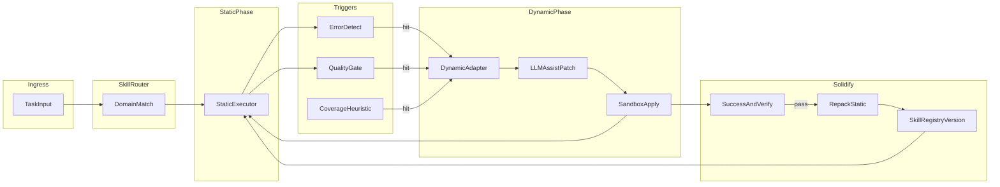
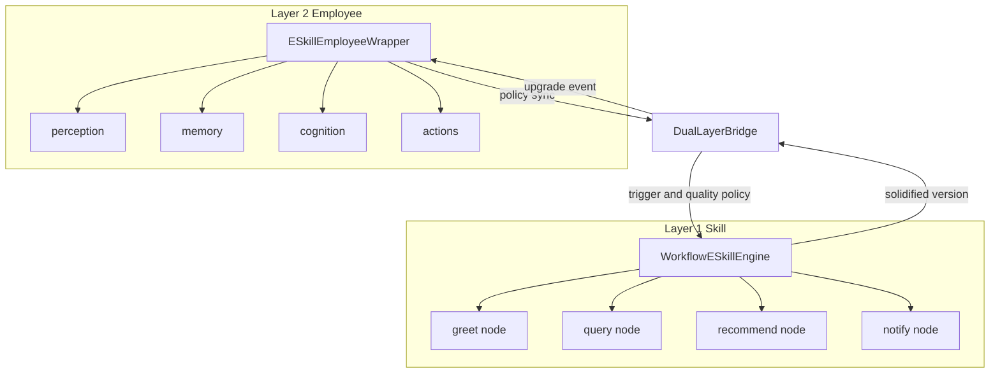

# ESkill（Evolvable Dynamic Static Skill）

**归属**：成都修茈科技有限公司  
**版本**：1.1  
**文档类型**：技术架构 / 实现设计

---

## 1. 定义与定位

**ESkill（Evolvable Dynamic Static Skill）** 是一种具备三层形态的技能单元：

| 形态 | 含义 |
|------|------|
| **静态 Skill（默认）** | 逻辑与参数固定、封装完整，低成本快速执行 |
| **动态 Skill（临时）** | 在边界内临时放开封装，由运行时与大模型协同微调逻辑与参数 |
| **固化后的新静态 Skill** | 动态阶段验证成功的变更被重新打包、版本化，回落为新的默认静态形态 |

从系统粒度看，ESkill 可同时存在于两个层级：**Skill 节点层**（工作流里的具体执行单元）与 **Employee 壳层**（管理多个 Skill 的 AI 员工容器，包含 perception / memory / cognition / actions 四层）；两层都遵循第 3 节的四阶段生命周期。

与传统「AI 员工 · 工作流」（例如产品中「专注工作流」类编排）的区别：

- **传统工作流**：侧重步骤编排与顺序执行，分支多为预先配置。
- **ESkill**：侧重**单一业务能力域内的自治执行**；在标准路径失败或场景升级时，**不跨界换技能**，而是在同一 Skill 内完成**自适应 → 验证 → 固化**，把经验沉淀为可再次低成本调用的静态封装。

---

## 2. 核心目标

1. **默认路径极轻**：常规任务走静态封装，延迟与 token 成本可控。
2. **失败与不达标可治理**：在同一业务边界内触发动态阶段，而非笼统交给通用 Agent。
3. **可演化**：动态阶段的补丁经成功后写入新版本静态 Skill，形成持续改进闭环。
4. **与工作流协同**：工作流仍可负责跨 Skill 编排；每个节点可由 ESkill 承载，减少「硬编码分支爆炸」。

---

## 3. 四阶段生命周期

### 3.1 静态 Skill（默认常态）

- 逻辑固定、参数固定、接口与副作用边界清晰。
- 只处理该 Skill **契约内**的标准任务。
- **调用成本低、速度快**；推理模型可不参与或仅做极简校验。

### 3.2 动态触发条件

任务仍归属本 Skill 的业务范围，但出现以下任一情况可触发「动态阶段」（策略可配置）：

| 触发类型 | 说明 |
|----------|------|
| **执行报错** | 运行时异常、依赖超时、校验失败等 |
| **结果不达标** | 与 Skill 声明的质量门槛或验收指标不符 |
| **场景特殊** | 输入分布、上下文或约束超出当前静态逻辑覆盖范围 |

**约束**：不跨界——仍由该 Skill 负责，只是难度或场景升级。

### 3.3 动态自适应阶段

Skill 进入「临时放开封装」模式：

- 允许修改或扩展**内部执行图**（分支、规则、参数映射）。
- **大模型辅助**：生成候选补丁（新增分支、异常处理、参数建议），由**运行时策略**决定是否采纳、如何组合。
- 可限定：**最大补丁范围、允许改动的模块白名单、单次动态阶段的预算（token / 步数）**。

### 3.4 静态收缩与自固化

动态路径下任务**执行成功且通过验收**后：

1. 将生效的变更（逻辑 diff + 参数档案）**收敛**为可重复执行的静态描述。
2. **重新打包、封装**，写入 **Skill 注册表** 的新版本（semver 或内部版本号）。
3. **默认路由**指向新版本静态 Skill；旧版本可保留用于回滚或 A/B。
4. （可选）对 Skill 关联的**轻量判别模型或打分器**做微调，用于触发预测或质量门禁。

此后常态再次变为：**新的静态 Skill**，循环重复上述四阶段。

---

## 4. 运行架构（逻辑组件）

| 组件 | 职责 |
|------|------|
| **SkillRouter** | 按任务领域 / 意图将请求绑定到唯一 Skill（不跨界）。 |
| **StaticExecutor** | 执行当前版本的静态逻辑（脚本、规则引擎、子图调用等）。 |
| **ErrorDetect / QualityGate / CoverageHeuristic** | 判断是否进入动态阶段；可组合加权。 |
| **DynamicAdapter** | 管理临时补丁会话、预算与回滚。 |
| **LLMAssistPatch** | 生成结构化补丁建议（非自由闲聊）。 |
| **SandboxApply** | 在隔离环境中应用补丁并重试执行。 |
| **RepackStatic + SkillRegistryVersion** | 固化成功路径并发布新版本默认静态 Skill。 |

---

## 5. 关键数据结构（建议）

### 5.1 Skill 元信息（`skill.meta`）

- `id`、`name`、`domain`（业务边界描述）
- `version`、`parent_version`（溯源）
- `entrypoints`（触发条件与输入 schema）
- `sla`（超时、重试策略）

### 5.2 静态逻辑（`skill.static`）

- 可序列化的执行图：节点、边、条件、工具绑定、默认参数表。
- **不可变快照**：某版本发布后内容冻结；演化产生新版本。

### 5.3 触发规则（`skill.triggers`）

- 错误类型列表、质量指标阈值、覆盖率 / 置信度规则。
- 与人审或二次确认的衔接标志（可选）。

### 5.4 动态补丁（`skill.patch.session`）

- `patch_id`、`base_version`、`proposals[]`（LLM 产出）
- `applied_delta`（实际生效的差异）
- `budget_used`、`trace_id`

### 5.5 版本记录（`skill.registry`）

- 版本链、变更说明、固化来源 `patch_id`、回滚指针。

### 5.6 评估指标（`skill.metrics`）

- 成功率、不达标率、动态触发率、固化频率、平均延迟与成本。

---

## 6. 与工作流（专注工作流 / AI 员工）的关系

- **工作流层**：多 Skill 编排、人机协同节点、外部系统集成顺序。
- **ESkill 层**：每个节点内部的「执行 + 自愈 + 沉淀」。
- **替代关系**：不是取消工作流，而是用 **ESkill 节点**替代「仅静态脚本、失败后人工改流程」的模式；工作流定义 **Who runs in what order**，ESkill 定义 **How this capability evolves inside its boundary**。
- 在涉及 AI 员工容器时，参见第 7 节「双层进化架构」。

---

## 7. 双层进化架构（Employee 壳 + Skill 节点）

双层进化架构把「真正干活的 Skill 节点」与「管理多个 Skill 的 AI Employee 壳」分开治理：节点层解决具体能力的自修复与固化，壳层解决感知、记忆、认知、行动等容器能力的自修复，并通过桥接层让两层升级互相传播。

### 7.1 两层职责对照

| 层级 | 定位 | 自修复对象 | 进化方式 |
|------|------|------------|----------|
| **Skill 节点层（Layer 1）** | 工作流中真正执行任务的节点 | 节点执行失败、输出质量不达标、API 超时等 | 静态执行 → 质量门控 → 规则 / LLM 修复 → 重试 → 固化新版本 |
| **Employee 壳层（Layer 2）** | 管理多个 Skill 的 AI 员工容器 | perception / memory / cognition / actions 任一层失败 | 层执行失败 → 规则 / LLM 修复 → 调整层参数 → 重试 |

### 7.2 结构图

### 7.3 升级传播

**Skill → Employee**：Skill 节点在动态修复成功后固化为新版本，触发 `on_solidified` 回调；`DualLayerBridge` 接收事件后通知关联的 Employee，Employee 通过 `_on_skill_solidified` 调整后续策略，例如提高对新版本节点的信任或调整调用偏好。

**Employee → Skill**：Employee 的 perception / memory / cognition / actions 任一层发生进化后，保存新配置，并通过 `sync_employee_to_skills` 将策略下推到旗下节点，例如调整质量门槛、触发策略或重试预算。

### 7.4 核心类清单

| 层级 | 核心类 | 职责 |
|------|--------|------|
| Employee 壳层 | `ESkillEmployeeWrapper` | 将 AI Employee 四层能力包装为可自修复容器 |
| Employee 壳层 | `EmployeeLayerConfig` | 定义四层启用状态、质量门控与触发策略 |
| Employee 壳层 | `EmployeeLayerRunResult` | 汇总四层执行结果、补丁与耗时 |
| Skill 节点层 | `ESkillNodeWrapper` | 为单个工作流节点提供自修复、重试与固化能力 |
| Skill 节点层 | `SkillNodeConfig` | 定义节点类型、质量门控、降级策略与重试次数 |
| Skill 节点层 | `SkillNodeRunResult` | 汇总节点输出、是否修复、补丁与错误信息 |
| Skill 节点层 | `WorkflowESkillEngine` | 管理多个可进化工作流节点 |
| 桥接层 | `DualLayerBridge` | 连接 Employee 与 Skill 两层，处理升级传播与策略同步 |
| 桥接层 | `DualLayerOrchestrator` | 面向调用方的一体化 Employee + Skill 编排入口 |
| 桥接层 | `UpgradeEvent` | 描述层间传播的升级事件 |

### 7.5 与单层生命周期的关系

双层架构不引入新的生命周期阶段，而是在两个不同粒度上各自运行第 3 节的四阶段：Skill 节点层围绕单个业务节点完成「静态 → 触发 → 动态 → 固化」，Employee 壳层围绕容器内部的 perception / memory / cognition / actions 层完成同样的自修复闭环。第 4 节的运行架构图仍适用于每一层内部。

### 7.6 无 LLM 降级

两层都应支持无 LLM 模式：有 LLM 时可先规则修复、再请求模型生成结构化补丁；无 LLM 时回落到规则修复、降级策略与失败记录。Employee 层与 Skill 层各自独立降级，一层失败不应阻塞另一层的既有稳定路径。

---

## 8. 落地建议

### 8.1 MVP

1. 单 Skill、显式 schema + 静态执行器（无 LLM 或仅异常摘要）。
2. 触发条件：`error` OR `quality_below_threshold`。
3. 动态阶段：LLM 输出 **JSON Patch / 结构化 DSL**，经校验后应用；成功后写入 `v0.2` 静态包。
4. 注册表：文件或 DB 存储版本元数据；默认指针指向最新通过验收的版本。

### 8.2 后续扩展

- 触发预测（轻量模型）降低无效动态开启。
- 多租户隔离与补丁审计。
- 与 CI 类似的「Skill 变更流水线」：自动化回归集后再 promote。

### 8.3 风险与边界

- **安全**：动态阶段必须有 schema 校验、工具白名单、资源限额。
- **一致性**：固化前必须通过同一套验收用例或人工抽检策略。
- **边界**：严格 `domain` 校验，防止动态阶段「Skill 越权」扩大职责。

---

## 9. 术语表

| 术语 | 说明 |
|------|------|
| 静态 Skill | 默认封装形态，逻辑与参数固定 |
| 动态阶段 | 临时放开封装，允许补丁与模型辅助 |
| 固化 | 将成功路径收敛为新版本静态 Skill |
| 不跨界 | 任务仍归属当前 Skill 的业务契约 |

---

## 10. 文档变更记录

| 日期 | 变更 |
|------|------|
| 2026-05-03 | 1.1：增加第 7 节双层进化架构章节，与 `eskill-prototype/docs/DUAL_LAYER_ARCHITECTURE.md` 对齐 |
| 2026-05-03 | 初版技术架构文档（成都修茈科技有限公司） |
