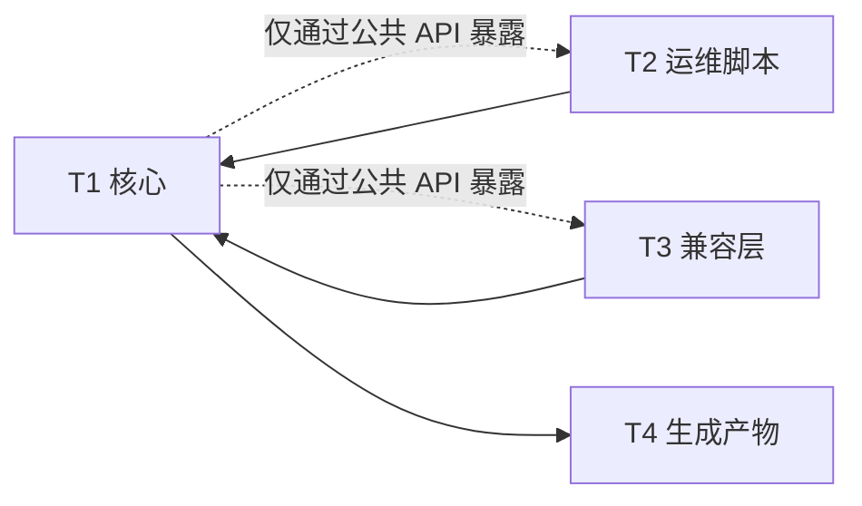

# 贡献指南：代码分层与质量门禁

本仓库混合了**核心服务代码**（FastAPI + Java + Vue 前端）、**部署 / 运维脚本**、**迁移与兼容层**、**生成产物**。同一个仓库里这些代码不能用同一把尺子衡量；下面把它们划成 4 个等级（T1–T4），并写明每一等级的质量门禁、彼此之间的依赖规则与新增 / 退役流程。

> 本文档与 [`docs/SERVICE_BOUNDARIES.md`](docs/SERVICE_BOUNDARIES.md) 互补。后者管「核心内部 Employee / Workflow / LLM 三个域之间」的边界，本文档管「核心 vs 外围 / 兼容 / 生成」之间的边界。

## 1. 等级总览

| 等级 | 路径 | 角色 | 门禁 |
| --- | --- | --- | --- |
| **T1 核心** | `modstore_server/`（除 `modstore_server/scripts/`、`*_compat*`、`legacy_*`）；`market/src/`（除 `market/src/legacy/**`、生成目录）；`java_payment_service/src/main/**`；`MODstore/modstore_server/`；`mod_sdk/` 等领域代码 | 生产 / 用户面对的代码 | 必须：CI 全绿（pytest、mvn verify、`npm run test:coverage`）；`black + isort + mypy`（按 `pyproject.toml` `[tool.mypy].files` 渐进扩大）；ESLint + 类型检查（前端）；review 至少一人；变更影响支付 / 鉴权时另需 `docs/PAYMENT_GRAY_RELEASE.md` 预检 |
| **T2 运维 / 工具脚本** | `scripts/**`、`chaos/**`、`perf/**`、`deploy/**`、`modstore_server/scripts/**`、`alembic/**`、`tools/**`（如有） | 部署、备份、迁移、压测、混沌等运维资产 | 必须：本地或预发跑通；shell / PowerShell 脚本通过 [`scripts/sre_smoke_check.py`](scripts/sre_smoke_check.py) 或对应 dry-run；Python 脚本遵守 `black/isort` 但**不要求** `mypy`、不要求 100% 测试覆盖；新增脚本要在 [`docs/runbooks/`](docs/runbooks/) 下登记一行用途 |
| **T3 兼容层 / 退役中** | 任何含 `*_compat*`、`legacy_*` 命名的模块；ADR 中标记为「退役中」的模块（如 [`modstore_server/routes_registry.py`](docs/ADR-routes-registry-retirement.md) 涉及的双轨入口） | 维持向后兼容、迁移期双写 / 双轨；不接收新功能 | 必须：每条入口在 ADR 中登记调用方与删除条件；T1 不得新增对 T3 的 import（[§4 单向依赖](#4-单向依赖)）；定期复核退役条件；`tests/test_service_boundaries.py` 风格的快照（snapshot）作为债务预算，**只允许减小** |
| **T4 生成产物** | `contracts/openapi/*.json`、OpenAPI / 事件清单等自动生成文档；`*-lock.json`、`requirements*.lock`；`modstore_server/migrations/` 中的自动产物等 | 由上游脚本生成的产物，作为 CI / 线上对账依据 | 必须：**不要手改**；通过对应生成脚本回写（如 `python scripts/export_openapi.py`、`python scripts/generate_event_reference.py`）；CI 用 `--check` 模式拦截（见 [`docs/developer/README.md`](docs/developer/README.md)） |

## 2. 一句话定位

- 「核心代码写得不错，但工具脚本、兼容层、legacy 拖后腿」是一个**结构问题**：把同一仓库内不同等级的代码用同一把尺子比，自然不公平。
- 解决方式：用本表的 4 个等级把每个目录归类，让评审、lint、测试覆盖率门禁分别对位；T1 收紧、T2 求可用、T3 冻结并退役、T4 由脚本兜底。
- 对外叙述：T1 决定产品质量；T2 决定可运维度；T3/T4 决定演进可控度。任何对仓库整体打分都需要先看是哪一层。

## 3. 各等级新增 / 修改流程

### T1 核心

1. 改动位于 [`docs/SERVICE_BOUNDARIES.md`](docs/SERVICE_BOUNDARIES.md) 列出的某个域时，确保跨域调用走 `services/*` ports（lint 由 [`tests/test_service_boundaries.py`](tests/test_service_boundaries.py) 兜底）。
2. 函数 / 类签名变更触及 OpenAPI 时，跑 `python scripts/export_openapi.py`（或带 `--check` 在 CI）。
3. mypy 已纳入清单的文件（见 `pyproject.toml` `[tool.mypy].files`）必须保持类型干净；新增安全 / 注册类入口主动加入清单。
4. 对应单测落到 `tests/`（Python）、`market/src/__tests__/` 或 `__tests__`（前端）、`src/test/java/`（Java）。

### T2 运维 / 工具脚本

1. 新增脚本说明它解决什么场景、谁会调（人 / CI / 远程入口），并在最相关的 runbook 加一行（如 [`docs/runbooks/remote-server-operations.md`](docs/runbooks/remote-server-operations.md) 的 Action 表）。
2. 危险动作（删除、重启、覆写 DB）默认 dry-run；改为执行需显式 `--confirm` flag，参考 [`chaos/chaos_drill.py`](chaos/chaos_drill.py)、[`scripts/restore_postgres.py`](scripts/restore_postgres.py)。
3. 不引用 T1 内部模块；如确需复用核心逻辑，抽到 T1 的公共 API 层后再被脚本 import。

### T3 兼容层 / 退役中

1. **不在本层加新功能**。新需求一律走 T1。
2. 新增或调整一条兼容入口必须配 ADR：复制 [`docs/ADR-routes-registry-retirement.md`](docs/ADR-routes-registry-retirement.md) 模板，写明：
   - 入口位置（文件 / 路由 / 函数名）；
   - 调用方（前端 / 第三方 / 历史脚本）；
   - **删除触发条件**（连续 N 个发布周期无引用、灰度完成、上游切换完成等）；
   - 拥有人。
3. 在 [`tests/test_service_boundaries.py`](tests/test_service_boundaries.py) 风格的快照中登记债务（如新增跨域 import）。债务**只允许变小**，CI 会在快照失同步时红灯。
4. 现存示例 / 索引：
   - [`docs/ADR-routes-registry-retirement.md`](docs/ADR-routes-registry-retirement.md) — `routes_registry` 双轨退役；
   - [`docs/adr/0010-extract-llm-service.md`](docs/adr/0010-extract-llm-service.md)、[`0011-extract-employee-service.md`](docs/adr/0011-extract-employee-service.md)、[`0012-extract-workflow-service.md`](docs/adr/0012-extract-workflow-service.md) — 域抽出路线；
   - [`tests/test_knowledge_v1_compat.py`](tests/test_knowledge_v1_compat.py) — 知识库 v1 兼容路由的回归测试。
   - 新增条目请在本节追加一行。

### T4 生成产物

- 生成脚本与生成路径绑定登记于 [`docs/developer/README.md`](docs/developer/README.md) §「自动化生成」。
- CI 中以 `--check` 模式跑同一脚本；diff 非空即拦截。
- 直接手改 T4 文件视为门禁绕过，需要在 PR 描述中给出明确理由并在评审中获得豁免。

## 4. 单向依赖

强制规则：

1. **T1 不得 import T2 / T3**。运维脚本与兼容层都依赖核心，反向不成立。如果脚本里有可复用逻辑被核心需要，把这段逻辑提升到 T1 的公共模块。
2. **T2、T3 之间不互相 import**。运维脚本不依赖兼容层；兼容层不依赖运维脚本（否则环境差异会破坏兼容契约）。
3. T1 → T4 单向：核心可以*生成* T4 文件；T4 不参与运行时 import。

当前 lint 状态：[`tests/test_service_boundaries.py`](tests/test_service_boundaries.py) 已实现「跨域 import 不允许新增」的快照式门禁，可作为本规则未来扩展的参考实现（例如新增「`modstore_server` 不许 import `scripts`」）。在补 lint 前，T1 → T2/T3 的违规由 review 兜底。

## 5. lint / 类型检查 / 测试 政策

| 工具 | 范围 | 配置 |
| --- | --- | --- |
| `black` + `isort` | 整个 Python 仓 | [`pyproject.toml`](pyproject.toml) `[tool.black]` / `[tool.isort]`（line-length=100，py310） |
| `mypy` | 渐进扩大；当前包含安全栈与注册入口 | [`pyproject.toml`](pyproject.toml) `[tool.mypy].files`；新增 T1 文件主动加入清单，T2/T3 默认不入清单 |
| `pytest` | 整个仓 | `tests/` 目录；`fail_under = 80`（覆盖率门禁，见 `[tool.coverage.report]`），全树当前约 40%+，抬升前先补测 |
| `tests/test_service_boundaries.py` | T1 内部 Employee / Workflow / LLM 跨域 | 详见 [`docs/SERVICE_BOUNDARIES.md`](docs/SERVICE_BOUNDARIES.md) §3 |
| ESLint 9 flat | `market/`（前端） | [`market/eslint.config.js`](market/eslint.config.js)；历史代码中的 `no-empty` / `no-useless-escape` 已显式降为 warning，避免影响 T1 红灯，后续清理 PR 收紧 |
| `mvn verify` | `java_payment_service/` | Maven 默认契约测试 + Spotbugs（如启用） |
| OpenAPI / 事件 diff | T4 | `python scripts/export_openapi.py --check`；`generate_event_reference.py` |

新增 T1 代码默认承担上表所有适用门禁；新增 T2/T3 默认承担 black/isort 与 review，但不要求扩大 mypy 清单或上拉测试覆盖率。

## 6. 反模式

- 在 T2 脚本里维护业务逻辑（应该在 T1，脚本只编排）。
- 把「迁移期临时函数」无限期保留在 T1（应该改名为 `*_compat`、登记 ADR、移到 T3）。
- 删 T3 入口前不查调用方（应通过 ADR 「删除触发条件」字段确认）。
- 手改 T4 生成产物（应通过对应生成脚本）。
- 用「整仓库平均水平」对外评估代码质量（应分等级评估）。

## 7. 入口索引

- 服务边界：[`docs/SERVICE_BOUNDARIES.md`](docs/SERVICE_BOUNDARIES.md)、[`docs/service-boundaries-and-events.md`](docs/service-boundaries-and-events.md)
- ADR 目录：[`docs/adr/`](docs/adr/)、[`docs/ADR-routes-registry-retirement.md`](docs/ADR-routes-registry-retirement.md)
- 性能基线：[`docs/perf-benchmark-public.md`](docs/perf-benchmark-public.md)
- SRE / 演练：[`docs/sre-operating-model.md`](docs/sre-operating-model.md)、[`docs/runbooks/`](docs/runbooks/)、[`docs/runbooks/exercises/`](docs/runbooks/exercises/README.md)
- 开发者文档：[`docs/developer/README.md`](docs/developer/README.md)
