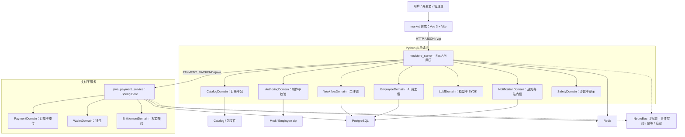
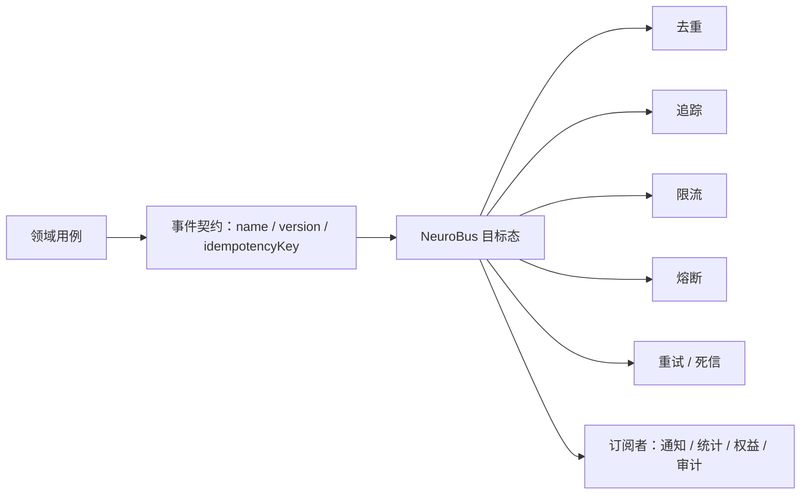
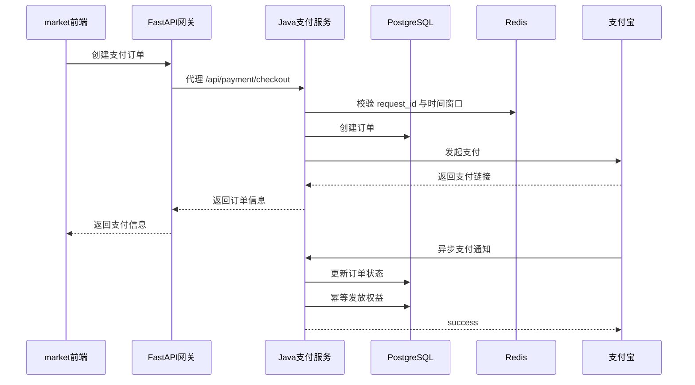

# MODstore Neuro-DDD 架构

本文档定义 MODstore 后续对齐 Neuro-DDD 的目标架构。它参考 `ddd.md` 中的“神经域 + NeuroBus + DDD 分层”思想，但以当前仓库的真实落点为准：

- 前端：`MODstore_deploy/market`
- Python 网关与应用编排：`MODstore_deploy/modstore_server`
- Java 支付子服务：`MODstore_deploy/java_payment_service`
- 文档与部署：`MODstore_deploy/docs`

## 1. 架构定位

MODstore 是面向 Mod、AI 员工包、工作流、支付/钱包/权益的独立平台。它需要同时满足两类目标：

- 当前交付：保持现有 Vue 3 + Vite 前端、FastAPI 网关、Python 业务模块和 Java 支付服务可运行。
- 后续对接：用清晰的领域边界、事件契约和应用层端口，为另一个 Neuro-DDD 项目或 XCAGI 主系统预留低耦合对接点。

目标不是一次性拆成很多服务，而是先把边界说清楚，再按风险从低到高逐步迁移。

## 2. 总体拓扑



### 当前事实

- `MODstore_deploy/market` 是 Vue 3 + Vite 前端，当前以 JavaScript 和 `.vue` 文件为主。
- `MODstore_deploy/modstore_server/app.py` 是 FastAPI 网关入口，集中挂载市场、工作台、员工、工作流、LLM、通知、退款、支付等路由。
- `MODstore_deploy/modstore_server/app.py` 已支持通过 `PAYMENT_BACKEND=java` 将 `/api/payment/*` 和 `/api/wallet/*` 代理到 Java 支付服务。
- `MODstore_deploy/java_payment_service` 是 Spring Boot 支付子服务，承载订单、支付、钱包、权益履约等能力。
- Python 支付实现仍存在，作为兼容与回滚路径；支付域目标是默认切到 Java 服务。

## 3. 分层原则

目标分层采用“接口层薄、应用层编排、领域层表达规则、基础设施可替换”的 DDD 方向。

| 层级 | 当前落点 | 目标职责 |
| --- | --- | --- |
| UI 层 | `market/src/views`、`market/src/components` | 页面、交互状态、路由，不直接散落业务协议细节 |
| API Client | `market/src/api.js` | 逐步拆分为按领域组织的 TypeScript client |
| 接口层 | `modstore_server/*_api.py`、`app.py` 中的路由 | 参数校验、鉴权、响应转换，只调用应用层 |
| 应用层 | 当前散落在 `modstore_server/*.py` | 用例编排、事务边界、跨领域协调 |
| 领域层 | 当前由业务函数、模型、校验逻辑混合承载 | Catalog、Employee、Workflow、Payment 等核心规则 |
| 基础设施层 | SQLAlchemy、文件系统、Redis、支付宝 SDK、HTTP proxy | 数据库、缓存、外部 API、文件与包存储实现 |
| 子服务 | `java_payment_service` | 独立承载高一致性、高并发或强隔离领域 |

## 4. MODstore 版 NeuroDomain

NeuroDomain 在 MODstore 中表示“自治业务域”。每个域应有清晰的输入、输出、数据所有权和可观测事件。

| NeuroDomain | 现有代表文件 | 领域职责 |
| --- | --- | --- |
| CatalogDomain | `catalog_api.py`、`catalog_store.py`、`market_api.py` | 公网目录、本地包索引、检索、购买入口 |
| AuthoringDomain | `authoring.py`、`mod_ai_scaffold.py`、`mod_scaffold_runner.py` | Mod 制作、AI 脚手架、manifest 读写与校验 |
| EmployeeDomain | `employee_api.py`、`employee_runtime.py`、`employee_pack_export.py` | AI 员工配置、员工包导出、员工运行态 |
| WorkflowDomain | `workflow_api.py`、`workflow_engine.py`、`workflow_scheduler.py` | 工作流图、沙盒运行、调度与变量 |
| PaymentDomain | `payment_api.py`、`java_payment_service/.../PaymentController.java` | 下单、支付回调、订单状态 |
| WalletDomain | `java_payment_service/.../WalletController.java` | 钱包余额、充值、交易记录 |
| EntitlementDomain | `java_payment_service/.../EntitlementService.java` | 支付成功后的购买权益与套餐额度 |
| LLMDomain | `llm_api.py`、`llm_chat_proxy.py`、`llm_key_resolver.py` | 模型目录、BYOK、对话代理、配额消耗 |
| NotificationDomain | `notification_api.py`、`notification_service.py` | 站内通知、业务提醒 |
| SafetyDomain | `package_sandbox_audit.py`、`security.py`、`quota_middleware.py` | 沙盒审核、鉴权、配额、签名与安全门 |
| AnalyticsDomain | `analytics_api.py` | 数据看板、执行统计 |
| IntegrationDomain | `workflow_mod_link.py`、`catalog_sync.py` | 与 XCAGI、Mod 根目录、外部目录同步 |

这些域可以先保持同进程模块化，不要求立即拆成独立服务。拆服务的判断标准是：数据一致性要求、部署节奏、故障隔离、团队边界和性能压力。

## 5. NeuroBus 目标态

当前系统大量逻辑仍是同步函数调用或 HTTP 调用。NeuroBus 的第一阶段不是立即引入复杂消息中间件，而是先定义事件契约与发布点。



建议优先定义这些事件：

| 事件 | 生产者 | 消费者 |
| --- | --- | --- |
| `catalog.package_published` | CatalogDomain / AuthoringDomain | NotificationDomain、AnalyticsDomain |
| `employee.pack_registered` | EmployeeDomain | CatalogDomain、SafetyDomain |
| `workflow.sandbox_completed` | WorkflowDomain | EmployeeDomain、AnalyticsDomain |
| `payment.order_paid` | PaymentDomain | EntitlementDomain、NotificationDomain、AnalyticsDomain |
| `wallet.balance_changed` | WalletDomain | NotificationDomain、AnalyticsDomain |
| `llm.quota_consumed` | LLMDomain | WalletDomain 或 Quota 模块、AnalyticsDomain |

事件字段建议固定为：

```json
{
  "event_id": "uuid",
  "event_name": "payment.order_paid",
  "event_version": 1,
  "occurred_at": "2026-04-26T00:00:00Z",
  "producer": "payment",
  "idempotency_key": "order:MOD1234567890:paid",
  "subject_id": "MOD1234567890",
  "payload": {}
}
```

## 6. 支付域微服务化

支付是当前最适合优先拆出的领域，因为它涉及金额、一致性、防重放、第三方回调和履约幂等。



迁移原则：

- Java 服务成为支付、钱包、权益的默认实现。
- Python `payment_api.py` 保留为短期兼容路径，用于灰度和回滚。
- FastAPI 网关只负责认证透传、路由代理、错误转换，不再承载支付业务规则。
- 支付成功后的通知、统计、审计通过事件或 outbox 逐步解耦。

## 7. 前端 TypeScript 迁移

前端当前技术栈偏基础，直接全量改 TS 风险较高。推荐按“类型边界优先”的方式迁移：

1. 新增 `tsconfig.json`，允许 JS 与 Vue 共存。
2. 把 `api.js` 拆为 `api/client.ts`、`api/auth.ts`、`api/catalog.ts`、`api/payment.ts`、`api/workflow.ts`。
3. 为后端响应定义领域 DTO，例如 `CatalogItem`、`OrderSummary`、`WalletBalance`、`EmployeePack`、`WorkflowGraph`。
4. 把可复用逻辑先迁移为 `.ts`，再逐步迁移页面组件。
5. 路由表、路由 meta、权限守卫单独抽出，减少页面与鉴权耦合。

目标结构示例：

```text
market/src/
├── api/
│   ├── client.ts
│   ├── auth.ts
│   ├── catalog.ts
│   ├── payment.ts
│   └── workflow.ts
├── domain/
│   ├── catalog.ts
│   ├── employee.ts
│   ├── payment.ts
│   └── workflow.ts
├── router/
│   ├── index.ts
│   └── guards.ts
└── views/
```

## 8. Python 服务解耦路线

`modstore_server` 当前以单包模块组织，适合先做“包内分层”，再判断是否拆服务。

目标结构示例：

```text
modstore_server/
├── api/
│   ├── catalog.py
│   ├── employee.py
│   ├── workflow.py
│   └── llm.py
├── application/
│   ├── catalog_service.py
│   ├── employee_service.py
│   ├── workflow_service.py
│   └── ports.py
├── domain/
│   ├── catalog.py
│   ├── employee.py
│   ├── workflow.py
│   └── events.py
├── infrastructure/
│   ├── db.py
│   ├── package_store.py
│   ├── catalog_store.py
│   ├── llm_clients.py
│   └── event_bus.py
└── app.py
```

迁移时不要先大规模移动文件。更稳妥的顺序是：

1. 新代码按目标分层落位。
2. 老路由保留路径不变，内部改为调用 application service。
3. application service 通过 ports 访问文件、数据库、LLM、外部 HTTP。
4. 老模块只作为兼容包装，逐步减少直接引用。
5. 有测试覆盖后再移动或删除旧函数。

## 9. 对接边界

为后续对接另一个 Neuro-DDD 项目，MODstore 需要稳定三类边界：

- HTTP/OpenAPI：面向前端、管理端、外部调用方。
- Package/Manifest：面向 Mod、employee_pack、bundle 的包格式协议。
- Event Contract：面向异步流程、审计、通知、统计和跨服务集成。

建议将稳定契约沉淀到 `docs/adr` 或独立 `docs/contracts`，例如：

```text
docs/contracts/
├── events/
│   ├── payment.order_paid.v1.json
│   └── employee.pack_registered.v1.json
├── openapi/
└── manifest/
```

## 10. 分阶段路线图

| 阶段 | 目标 | 交付物 |
| --- | --- | --- |
| P0 | 统一架构语言和边界 | 本文档、文档入口、迁移原则 |
| P1 | 前端类型边界 | TS 配置、API client 拆分、核心 DTO |
| P2 | Python 包内分层 | application/domain/infrastructure 新结构，路由变薄 |
| P3 | 支付默认微服务化 | `PAYMENT_BACKEND=java` 生产默认，Python 支付退为兼容 |
| P4 | 事件契约与异步化 | NeuroBus/outbox、幂等键、追踪、订阅者 |
| P5 | 服务拆分评估 | 根据负载和团队边界拆出 Employee、Workflow、LLM 等子服务 |

详细执行文档：

- `../../docs/roadmap/cleanup-organization.md`
- `../../docs/roadmap/frontend-ts-p1.md`
- `../../docs/roadmap/backend-neuroddd-p1.md`
- `../../docs/roadmap/ops-metrics-p2.md`
- `../../docs/roadmap/event-driven-architecture.md`

## 11. .xcemp 双身份产物（平台包 + zipapp CLI）

从 2026-05 起，`_build_employee_pack_zip_with_source` 导出的每个 `.xcemp`
文件同时具备两种身份，**不改变任何现有平台接口**：

### 11.1 zip 内布局

```
<pack_id>.xcemp
├── __main__.py                         # zipapp 入口（顶层）
├── <pack_id>/
│   ├── manifest.json                   # 不变（平台入口）
│   ├── backend/blueprints.py           # 不变
│   ├── backend/employees/<stem>.py     # 不变
│   └── standalone/                     # 新增（对平台透明）
│       ├── cli.py                      # argparse 子命令
│       ├── runner.py                   # manifest 路由
│       ├── llm_adapter.py              # stdlib urllib LLM 客户端
│       ├── handlers/no_llm.py          # 机械检查（零依赖）
│       ├── handlers/llm_md.py          # LLM Markdown 输出
│       └── README.md                   # 本地用法
```

### 11.2 本地用法

```bash
python <pack_id>.xcemp info                     # 打印 manifest 摘要
python <pack_id>.xcemp validate                 # 零依赖结构校验
python <pack_id>.xcemp run                      # no-llm 机械检查
python <pack_id>.xcemp run --input task.json    # 传入任务输入
python <pack_id>.xcemp run --llm                # 需 OPENAI_API_KEY 或 DEEPSEEK_API_KEY
```

### 11.3 涉及文件

| 文件 | 说明 |
|------|------|
| `modstore_server/employee_pack_standalone_template.py` | 模板渲染器，生成 standalone/* 源码 |
| `modstore_server/employee_pack_export.py` | `_build_employee_pack_zip_with_source` 注入顶层 `__main__.py` 与 `standalone/` |
| `modstore_server/workbench_api.py` | 制作流水线追加 `standalone_smoke` 步骤（第 12 步，失败降级 warning）|
| `market/src/employeePackClientExport.ts` | 浏览器兜底导出函数同步注入同样内容 |
| `tests/test_employee_pack_standalone.py` | subprocess 端到端测试 |

### 11.4 向后兼容

- 平台运行时只通过 `<pack_id>/manifest.json` 与 `backend/` 加载，顶层 `__main__.py`
  与 `standalone/` 对平台完全透明。
- 老 `.xcemp`（无 `__main__.py`）导入平台不受影响。
- `validate_manifest_dict` 与 manifest schema 未改动。

## 12. 提交前自检

- 新增 API 是否有明确领域归属。
- 路由是否只做参数、鉴权和响应转换。
- 业务规则是否避免散落在前端或路由函数里。
- 支付、钱包、权益相关改动是否优先考虑 Java 服务。
- 前端新增共享逻辑是否优先补类型，而不是继续扩大 `api.js`。
- 跨领域副作用是否能表达为事件，并具备幂等键。
