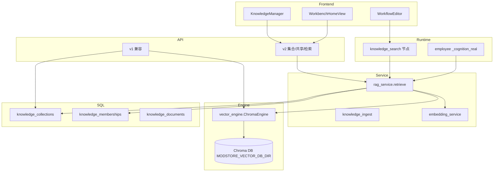

# 知识库 RAG 与统一向量数据库

本文档对应 `MODstore_deploy` 后端的 RAG 实现，覆盖：

- 统一向量引擎（Chroma `PersistentClient`）
- 集合(Collection)、共享授权(Membership)、文档(Document) 三层模型
- 自动 RAG 注入到 AI 员工 cognition、工作流 `knowledge_search` 节点、前端聊天
- v1（兼容）与 v2（多 owner + 共享）API
- 从旧 Redis Stack KB 迁移

## 架构



## 关键文件

| 文件 | 角色 |
|---|---|
| [`modstore_server/vector_engine.py`](../modstore_server/vector_engine.py) | 单例 Chroma `PersistentClient`；upsert/query/delete/count |
| [`modstore_server/embedding_service.py`](../modstore_server/embedding_service.py) | OpenAI 兼容外部 embedding 客户端 |
| [`modstore_server/knowledge_ingest.py`](../modstore_server/knowledge_ingest.py) | 文件解析（pdf/docx/xlsx/...）+ 分块 + page metadata |
| [`modstore_server/knowledge_vector_store.py`](../modstore_server/knowledge_vector_store.py) | v1 门面，对外 API 不变；按 `MODSTORE_VECTOR_BACKEND` 选 chroma/redis |
| [`modstore_server/knowledge_vector_store_redis.py`](../modstore_server/knowledge_vector_store_redis.py) | 旧 Redis Stack 实现（兼容路径，迁移用） |
| [`modstore_server/rag_service.py`](../modstore_server/rag_service.py) | 多集合并集 + 权限 + rerank + prompt 注入 |
| [`modstore_server/knowledge_v2_api.py`](../modstore_server/knowledge_v2_api.py) | v2 路由 |
| [`modstore_server/knowledge_vector_api.py`](../modstore_server/knowledge_vector_api.py) | v1 路由（不变） |
| [`modstore_server/employee_executor.py`](../modstore_server/employee_executor.py) | `_cognition_real` 接 RAG；`_memory_long_term_chroma` 走统一引擎 |
| [`modstore_server/workflow_engine.py`](../modstore_server/workflow_engine.py) | 注册 `knowledge_search` 节点 |
| [`scripts/migrate_kb_redis_to_chroma.py`](../scripts/migrate_kb_redis_to_chroma.py) | Redis → Chroma 幂等迁移脚本 |

## 集合模型

每条 `KnowledgeCollection` 行对应**一个**物理 Chroma 集合 `kb_<collection_id>`。

| 字段 | 说明 |
|---|---|
| `owner_kind` | `user` / `employee` / `workflow` / `org` |
| `owner_id` | 对应实体 ID（user_id 字符串、employee_pack_id、workflow_id 字符串、org_id） |
| `name` | 集合名（owner 内唯一） |
| `visibility` | `private` / `shared` / `public` |
| `embedding_model` | 创建时的嵌入模型名（如 `text-embedding-3-small`） |
| `embedding_dim` | 嵌入维度（每集合独立） |
| `chunk_count` | 缓存的总 chunk 数 |

**共享**：通过 `KnowledgeMembership(grantee_kind, grantee_id, permission)` 把集合 grant 给另一个 owner（user/employee/workflow/org）。`permission ∈ {read, write, admin}`。

## 检索可见性规则

`rag_service.visible_collection_ids(user_id, employee_id?, workflow_id?, org_id?, permission='read')` 解析候选集合：

1. 当前身份链（user + employee/workflow/org）拥有的集合
2. 这些身份被 grant 的集合（按 permission 过滤）
3. `visibility='public'` 的全部集合（仅 read）

`/api/knowledge/v2/retrieve` 接受 `collection_ids` 显式裁剪，但仍受可见性过滤。

## v1 → v2 兼容

| 场景 | v1 行为 | v2 行为 |
|---|---|---|
| 上传文档 | `POST /api/knowledge/documents` 写入用户默认集合 | `POST /api/knowledge/v2/collections/{id}/documents` |
| 列出文档 | 仅返回我自己默认集合 | 任意可访问集合 |
| 搜索 | `POST /api/knowledge/search` 仅 user_id 隔离 | `POST /api/knowledge/v2/retrieve` 跨集合，可带 `employee_id` |
| 集合管理 | 不支持 | `/api/knowledge/v2/collections/*` |

v1 改造为 chroma 后端后，前端**不需要任何修改**也能继续工作。

## 自动 RAG 注入

### AI 员工

`employee_config_v2.cognition.knowledge` 配置：

```json
{
  "cognition": {
    "system_prompt": "你是助手",
    "model": {"provider": "openai", "model_name": "gpt-4o-mini"},
    "knowledge": {
      "enabled": true,
      "top_k": 6,
      "min_score": 0.0,
      "collection_ids": [12, 18]
    }
  }
}
```

启用时 `_cognition_real` 在调 LLM 前自动调用 `rag_service.retrieve(employee_id=...)`，把片段附加到 system prompt 末尾，并在返回值 `knowledge.items` 暴露引用。

### 工作流 `knowledge_search` 节点

新节点类型 `knowledge_search`，配置：

| 字段 | 说明 |
|---|---|
| `query` 或 `query_template` | 检索文本，支持 `${var.path}` 模板 |
| `collection_ids` | 显式指定集合（受可见性裁剪） |
| `employee_id` / `workflow_id` | 带上额外身份上下文 |
| `top_k` / `min_score` | 检索控制 |
| `output_var` | 写入 `data` 的键名（默认 `knowledge`） |

沙盒模式下走 `_execute_knowledge_search_mock`，不真实查向量库。

### 前端聊天

`WorkbenchHomeView.vue` 优先调 `/api/knowledge/v2/retrieve`，自动带 `employee_id=activeBot.id`。失败回退到 v1（仅当用户上传附件时）。

## 部署 / env 变量

| 变量 | 默认 | 说明 |
|---|---|---|
| `MODSTORE_VECTOR_BACKEND` | `chroma` | `chroma` / `redis`（兼容） |
| `MODSTORE_VECTOR_DB_DIR` | `modstore_server/data/chroma` | Chroma 持久化目录；compose 配置为 `/data/chroma` 落入 `modstore_data` 卷 |
| `MODSTORE_EMBEDDING_API_KEY` | (空) | OpenAI 兼容 embedding API Key |
| `MODSTORE_EMBEDDING_BASE_URL` | `https://api.openai.com/v1` | embedding 服务 base URL |
| `MODSTORE_EMBEDDING_MODEL` | `text-embedding-3-small` | embedding 模型名 |
| `MODSTORE_EMBEDDING_DIM` | `1536` | 与模型一致 |
| `MODSTORE_KB_MAX_UPLOAD_BYTES` | `20971520` | 单文件上限 |
| `MODSTORE_KB_CHUNK_SIZE` | `1000` | 分块大小 |
| `MODSTORE_KB_CHUNK_OVERLAP` | `120` | 分块重叠 |
| `MODSTORE_RAG_RERANK` | (空) | 设为 `cross-encoder` 启用 sentence-transformers 重排 |
| `MODSTORE_RAG_RERANK_MODEL` | `cross-encoder/ms-marco-MiniLM-L-6-v2` | rerank 模型 |
| `MODSTORE_VECTOR_REDIS_URL` / `REDIS_URL` | (空) | 仅迁移期使用 |

容器依赖通过 `pip install -e ".[web,knowledge]"` 安装（`chromadb/pypdf/python-docx/openpyxl`）。

### 动态 Embedding 匹配

知识库上传和检索会把当前场景的 provider/model 作为提示传给后端，但后端不会把聊天模型直接当作向量模型。实际解析顺序为：

1. 显式 `MODSTORE_EMBEDDING_*` 全局配置。
2. 当前 provider 的专用配置，例如 `MODSTORE_EMBEDDING_MODEL_XIAOMI` / `MODSTORE_EMBEDDING_DIM_XIAOMI`。
3. 用户 BYOK 或平台 key 中支持 embedding 的厂商：`openai`、`siliconflow`、`dashscope`、`zhipu`、`together`。
4. 若当前聊天/制作模型（例如 `xiaomi / mimo-v2-pro`）没有可用 `/embeddings`，自动回退到上述可用 embedding provider。

同一集合会锁定实际的 `embedding_provider`、`embedding_model`、`embedding_dim`。已有向量的集合若后续解析到不同模型或维度，会拒绝写入，避免不同维度混入同一索引。

小米 MiMo 只有在其网关确认支持 `/embeddings`，并配置了模型与维度时才会用于向量索引：

```bash
MODSTORE_EMBEDDING_MODEL_XIAOMI=<小米提供的 embedding 模型 id>
MODSTORE_EMBEDDING_DIM_XIAOMI=<对应向量维度>
# 可选；默认走 XIAOMI_BASE_URL
MODSTORE_EMBEDDING_BASE_URL_XIAOMI=https://token-plan-cn.xiaomimimo.com/v1
```

## 迁移流程

```bash
# 1) 先 dry-run 看影响范围
python scripts/migrate_kb_redis_to_chroma.py --dry-run

# 2) 真正迁移（幂等）
python scripts/migrate_kb_redis_to_chroma.py

# 3) 切流量到 chroma 后端（默认就是 chroma）
export MODSTORE_VECTOR_BACKEND=chroma

# 4) 验证
curl -H "Authorization: Bearer $TOKEN" $API/api/knowledge/v2/status
```

## 测试

`tests/` 下相关：

- `test_vector_engine_chroma.py` 引擎基础行为
- `test_knowledge_v1_compat.py` v1 走 chroma 后兼容性
- `test_rag_service.py` 可见性 / 权限 / 注入
- `test_knowledge_v2_api.py` v2 路由与隔离
- `test_employee_cognition_rag_inject.py` 员工 cognition 自动注入
- `test_workflow_knowledge_search_node.py` 工作流节点 + 校验

跑全部 RAG 测试：

```bash
pytest tests/test_vector_engine_chroma.py \
       tests/test_knowledge_v1_compat.py \
       tests/test_rag_service.py \
       tests/test_knowledge_v2_api.py \
       tests/test_employee_cognition_rag_inject.py \
       tests/test_workflow_knowledge_search_node.py
```
