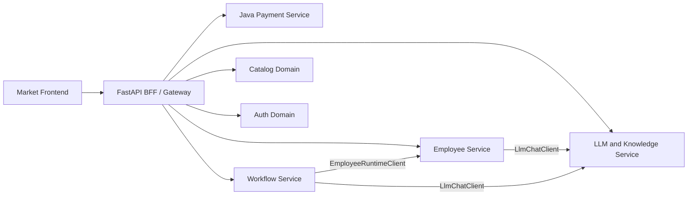

# Employee / Workflow / LLM 服务拆分规划

本文档与 [`docs/service-boundaries-and-events.md`](./service-boundaries-and-events.md) 配套，专注于 Python 单体内 **Employee、Workflow、LLM** 三大领域的拆分前置工作。目标：在不立即拆出独立进程的前提下，先把领域之间的耦合降到「只通过 ports（接口）调用」，让未来抽出三个微服务变成机械替换。

> 支付/Java/事件相关边界请阅读 [`docs/PAYMENT_CONTRACT.md`](./PAYMENT_CONTRACT.md) 与 `service-boundaries-and-events.md`。

## 1. 服务边界一览

### 1.1 模块归属

| 服务 | 当前 Python 模块 | API 表面 | 数据 | 备注 |
| --- | --- | --- | --- | --- |
| Employee | `employee_api.py`、`employee_executor.py`、`employee_runtime.py`、`employee_config_v2.py`、`employee_pack_export.py`、`employee_ai_scaffold.py` | `/api/employees/**`、`/api/mods/{id}/workflow-employees/**`、`/api/mods/{id}/export-employee-pack` | `EmployeeExecutionMetric`、`CatalogItem(artifact='employee_pack')` 部分 | 执行入口必须经过 `EmployeeRuntimeClient` |
| Workflow | `workflow_api.py`、`workflow_engine.py`、`workflow_scheduler.py`、`workflow_variables.py`、`workflow_nl_graph.py`、`workflow_mod_link.py`、`workflow_employee_scaffold.py` | `/api/workflow/**` | `Workflow`、`WorkflowNode`、`WorkflowEdge`、`WorkflowExecution`、`WorkflowTrigger` | 调用 employee/llm 必须走 ports |
| LLM | `llm_api.py`、`llm_chat_proxy.py`、`llm_key_resolver.py`、`llm_catalog.py`、`llm_billing.py`、`llm_model_taxonomy.py`、`llm_crypto.py`、`knowledge_vector_api.py`、`knowledge_vector_store.py`、`embedding_service.py` | `/api/llm/**`、`/api/knowledge/**` | `UserLlmCredential`、`User.default_llm_json`、向量索引 | 第一阶段 LLM + Knowledge 合并；第二阶段再视量级拆分 |
| Payment（Java） | `java_payment_service/**` + `application/payment_gateway.py` | `/api/payment/**`、`/api/wallet/**`、`/api/refunds/**` | `Order`、`Wallet`、`Transaction`、`Refund`、`UserPlan`、`Quota`、`Entitlement`（与 Python 共享 PostgreSQL） | 见 `PAYMENT_CONTRACT.md` |
| 平台层（不拆） | `auth_service.py`、`market_api.py` 中 auth+wallet 入口、`catalog_api.py`、`catalog_store.py`、`api/deps.py`、`infrastructure/db.py`、`eventing/**` | `/api/auth/**`、`/api/market/**`、`/v1/**`、事件总线 | `User`、`CatalogItem`、`Purchase`、`PlanTemplate`、事件契约 | 通过事件解耦，不参与第一轮拆分 |

## 2. Ports（领域间调用接口）

为了让未来把任意一个域抽成独立进程，本仓引入三个客户端抽象（`modstore_server/services/`）。任何跨域调用必须经过这些 ports，**禁止**新代码直接 `from modstore_server.llm_chat_proxy import chat_dispatch` 或 `from modstore_server.employee_executor import execute_employee_task` 等跨域 import。

| Port | 模块 | 默认实现 | 拆分时替换为 |
| --- | --- | --- | --- |
| `LlmChatClient` | `services/llm.py` | 进程内调用 `llm_chat_proxy.chat_dispatch` | HTTP 客户端 → LLM 服务 |
| `EmployeeRuntimeClient` | `services/employee.py` | 进程内调用 `employee_executor.execute_employee_task` 等 | HTTP 客户端 → Employee 服务 |
| `WorkflowEngineClient` | `services/workflow.py` | 进程内调用 `workflow_engine.execute_workflow` 等 | HTTP 客户端 → Workflow 服务 |

每个 port 都是一个 ABC，附带：

- 默认 in-process 实现（保持现有行为，不引入回归）。
- 一个 `set_default_<x>_client()` / 全局 getter，方便注入 mock 或 HTTP 实现。
- 单元测试覆盖 port API 与默认实现一致性。

## 3. 边界规则（强制）

`tests/test_service_boundaries.py` 静态扫描以下规则；新增违反将导致 CI 红灯：

1. `employee_*` 模块**禁止**新增 `from modstore_server.workflow_*` import；必须经 `services.workflow.WorkflowEngineClient`。
2. `employee_*` 模块**禁止**新增 `from modstore_server.llm_*` import（除 `llm_model_taxonomy` 这种纯数据常量）；必须经 `services.llm.LlmChatClient`。
3. `workflow_*` 模块**禁止**新增 `from modstore_server.employee_*` import；必须经 `services.employee.EmployeeRuntimeClient`。
4. `workflow_*` 模块**禁止**新增 `from modstore_server.llm_*` import；必须经 `services.llm.LlmChatClient`。
5. `llm_*` 模块**禁止**新增 `from modstore_server.employee_*` 或 `from modstore_server.workflow_*` import（LLM 必须是叶子）。
6. 现存违反列在 `tests/test_service_boundaries.py::LEGACY_CROSS_DOMAIN_IMPORTS`，是技术债快照；不允许扩大；每移除一项就把对应行从 snapshot 删掉，CI 强制收敛。

## 4. 数据归属

- **Employee 拥有** `EmployeeExecutionMetric`，对外只暴露聚合视图。`CatalogItem.artifact='employee_pack'` 保持在 Catalog 平台层；Employee 通过 catalog 客户端读取。
- **Workflow 拥有** `Workflow*` 五张表；不写 `EmployeeExecutionMetric`，要登记执行指标必须经 `EmployeeRuntimeClient`（间接产生 metric）或独立的 workflow_execution 表。
- **LLM 拥有** `UserLlmCredential`；`User.default_llm_json` 因绑定到 `User` 表，第一阶段保留在平台层，第二阶段引入 `UserPreference` 行进行迁移。
- 共享只读：`User`、`CatalogItem`、`PlanTemplate`、`Quota`、`Entitlement`。
- 跨域写需要经过事件（`employee.pack_registered`、`workflow.sandbox_completed`、`llm.quota_consumed`），事件总线在 [`service-boundaries-and-events.md`](./service-boundaries-and-events.md) 已列。

## 5. 拆分顺序

1. 第 1 步（已完成）：定义 ports + 默认 in-process 实现 + 边界 lint。
2. 第 2 步：把现存 `legacy_cross_domain_imports` 收敛到 0，所有跨域调用都经 ports。
3. 第 3 步：实现 `LlmChatClient` 的 HTTP 实现并把 LLM 服务先抽出（最小耦合，最容易独立）。
4. 第 4 步：抽 Employee（依赖 LLM HTTP 实现）。
5. 第 5 步：抽 Workflow（依赖 Employee + LLM HTTP 实现）。
6. 第 6 步：评估是否引入独立 API Gateway，替换 FastAPI BFF（见 plan §阶段 4）。

## 6. 验收标准

- 三个 ports 与默认实现已存在并被调用。
- `tests/test_service_boundaries.py` 通过，且 `legacy_cross_domain_imports` 不再增长。
- Employee/Workflow/LLM 三个 API tag 在 OpenAPI 中独立，能直接挂在不同子域名/路径下。
- 当前测试套件无回归（`pytest`、`mvn verify`、`npm run test:coverage` 全绿）。
