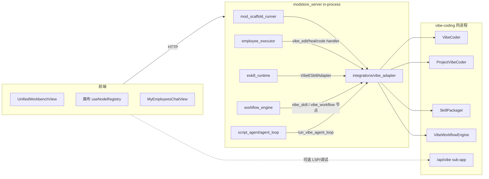

# vibe-coding 接入 MODstore_deploy

> 这份文档描述把同仓库内的 [`vibe-coding`](../../vibe-coding/) 包接入 MODstore 的设计、配置与运维要点。
> 当前实现状态:**已完成** Phase 0-4。代码入口与测试在 README 顶部链接里。

## 0. 关键事实

- vibe-coding 提供「NL → Python 代码 → 沙盒 → 自愈 / 多文件 patch / 项目级 heal」的整套能力,与 MODstore 的「制作 Mod / 制作员工 / 跑 Skill」三条线天然互补。
- 本接入采用 **path 依赖 + in-process import** 为主,vibe-coding 的 Web UI 作为可选 sub-app 挂在 `/api/vibe`,不引入额外进程。
- 没装 vibe-coding 时,所有接入点都会优雅降级(返回 `ok=false` + reason),不会让 MODstore 启动失败。

## 1. 安装

vibe-coding 与本仓库同级。开发 / 部署机推荐:

```bash
# 在 venv 里把 vibe-coding 以可编辑模式装进 MODstore 的 Python 环境
pip install -e ../vibe-coding[web]
# 然后再装 MODstore 自己
pip install -e .[web]
```

CI / 容器镜像可以用 `pip install .[vibe]` 来约束版本(`pyproject.toml` 已声明 `vibe = ["vibe-coding[web]>=0.1.0"]`)。

## 2. 环境变量

| 变量 | 默认 | 含义 |
|---|---|---|
| `MODSTORE_ENABLE_VIBE_WEB` | 关 | `1` 时把 `vibe_coding.agent.web.create_app()` 挂载到 `/api/vibe`(给 LSP / 调试 / 第三方消费用) |
| `VIBE_CODING_STORE_DIR` | `${MODSTORE_DATA_DIR}/vibe_coding` | 每个用户的 `VibeCoder` store_dir 在它下面再开 `users/<uid>/` 子目录 |
| `MODSTORE_TENANT_WORKSPACE_ROOT` | `${MODSTORE_DATA_DIR}/workspaces/{user_id}` | `vibe_edit` / `vibe_heal` 强制 root 必须落在这条 path 下,越界拒绝 |

`{user_id}` 占位符会被替换。所有 vibe action 入口都走
[`vibe_adapter.ensure_within_workspace`](../modstore_server/integrations/vibe_adapter.py),从根上挡住 `../` 路径穿越。

## 3. 接入点(对照原计划三条线)



### 3.1 制作 Mod

- 文件:[`mod_employee_impl_scaffold.py`](../modstore_server/mod_employee_impl_scaffold.py) `generate_mod_employee_impls_async(..., enable_vibe_heal=True)`
- 行为:每个员工 LLM 初稿写完后,调一次 `ProjectVibeCoder.heal_project(brief, max_rounds=2)` 自愈。
- 文件:[`mod_scaffold_runner.py`](../modstore_server/mod_scaffold_runner.py) `run_mod_suite_ai_scaffold_async(..., enable_vibe_heal=True)`
- 行为:导入 mod 后调 `index_project(refresh=True)` 缓存索引;`vibe_index` / `vibe_heal` 两段写到 `config/ai_blueprint.json`,`ModAuthoringView` 沙盒报告 Tab 会展示。

### 3.2 AI 员工

- 文件:[`employee_executor.py`](../modstore_server/employee_executor.py) `_actions_real`
- 新 handler:`vibe_edit` / `vibe_heal` / `vibe_code`,在 `manifest.employee_config_v2.actions.handlers` 里勾选。
- 配置示例:

```json
{
  "actions": {
    "handlers": ["vibe_edit"],
    "vibe_edit": {
      "root": "/data/workspaces/42/my-bot",
      "brief": "把 handlers/order.py 里的同步调用改成 async",
      "focus_paths": ["handlers/order.py"],
      "dry_run": false
    }
  }
}
```

LLM provider/model 不填时会读 `User.default_llm_json`。`root` 必须在用户工作区内。

### 3.3 ESkill 新 kind

- 文件:[`eskill_runtime.py`](../modstore_server/eskill_runtime.py) `_execute_logic`
- 新增 kind:`vibe_code`(NL → CodeSkill → 立即 run)和 `vibe_workflow`(NL → VibeWorkflowGraph → execute)。
- 也可以在 `pipeline.steps[]` 里嵌套这两种 step 类型。
- ESkillVersion 的 `static_logic_json` 示例:

```json
{
  "type": "vibe_code",
  "brief": "返回 input.text 的字符长度",
  "skill_id": "len-counter-1",
  "run_immediately": true,
  "output_var": "vibe_out"
}
```

### 3.4 画布 Skill 组节点

- 后端:[`workflow_engine.py`](../modstore_server/workflow_engine.py) `_execute_vibe_skill_node` / `_execute_vibe_workflow_node`,沙盒 mock 走 `_execute_vibe_node_mock`,验证器要求 `brief` 非空。
- 前端:[`useNodeRegistry.ts`](../market/src/views/workflow/v2/composables/useNodeRegistry.ts) 注册 `vibe_skill` / `vibe_workflow`,作者可在画布拖入,填 brief、skill_id、output_var 等,运行时同 ESkill 路径。

### 3.5 脚本工作流第二代

- 文件:[`script_agent/agent_loop.py`](../modstore_server/script_agent/agent_loop.py) `run_vibe_agent_loop`
- 与原 `run_agent_loop` 平行,事件流(`AgentEvent` SSE)对外契约一致;内部:
  1. `VibeCoder.code(brief, mode="brief_first")` 出代码(自带 vibe-coding 沙盒校验)。
  2. MODstore `validate_script` 走包白名单检查。
  3. MODstore `run_in_sandbox` 跑用户上传的 `inputs/`(因为 vibe-coding 不知道 ctx['files'] 约定)。
  4. MODstore `judge` 调 LLM 看输出是否符合 brief;失败时调用 `coder.code_factory.repair(skill_id, failure)` 进入下一轮。
- 文件:[`script_agent/llm_client.py`](../modstore_server/script_agent/llm_client.py) `RealLlmClient.from_user_session(...)`:与 `vibe_adapter.ChatDispatchLLMClient` 共用同一 BYOK 解析,避免双套配置。

### 3.6 工作台「AI 代码技能」全闭环

- 后端:[`workbench_api.py`](../modstore_server/workbench_api.py) `POST /api/workbench/vibe-code-skill`
- 前端:[`UnifiedWorkbenchView.vue`](../market/src/views/UnifiedWorkbenchView.vue) Tab `code_skill` → [`VibeCodeSkillPanel.vue`](../market/src/components/workbench/VibeCodeSkillPanel.vue)
- 流程:NL brief → `VibeCoder.code` → `coder.run(skill, run_input)` → 可选 `SkillPackager.package_skill` + 写 `catalog_store.append_package` + 写 `CatalogItem`,直接上架本 MODstore。

## 4. 安全与回滚

- **路径白名单**:`vibe_edit/heal` 强制走 `MODSTORE_TENANT_WORKSPACE_ROOT`,任何越界路径直接 `VibePathError`。
- **沙盒**:vibe-coding 自带 `SandboxDriver`(subprocess 默认,可扩展 docker)。MODstore 没有再叠一层。
- **回滚**:每次 `apply_patch` / heal 写 `PatchLedger`(在 `VibeCoder.store_dir`);失败时 `ProjectVibeCoder.rollback_patch(patch_id)` 即可。
- **租户隔离**:`vibe_coder` 缓存键含 `user_id`,不同用户拿到不同 store_dir 与 LLMClient session,互不串。

## 5. 调试 / 排查

- 启用 `MODSTORE_ENABLE_VIBE_WEB=1` 后,本地访问 `http://127.0.0.1:8000/api/vibe/` 可以打开 vibe-coding 自带的单页 UI(用 `MockLLM`,只用于看网络是否通)。
- vibe action 失败会以 `{"handler": "vibe_*", "ok": false, "error": ...}` 形式返回到员工任务结果,前端「我的员工」聊天页可见。
- 工作台「AI 代码技能」的 `publish` 失败会带回 `error` 字段,可用于人工修复。

## 6. 已知边界

- `vibe_heal` 单次完整执行可能 30 秒以上,默认是同步等待。如果你打算把它放在面向终端用户的同步聊天里,务必给员工任务设较大的 `timeout`,或考虑改用脚本工作流。
- ESkill 的 `quality_gate` 不会自动校验 `vibe_code` 的运行结果(因为 vibe 自带 brief_first 沙盒了);如需双重校验,在 `pipeline.steps` 里把 `vibe_code` 的输出再传给一个 `template_transform` / `tool_call` step 做断言。
