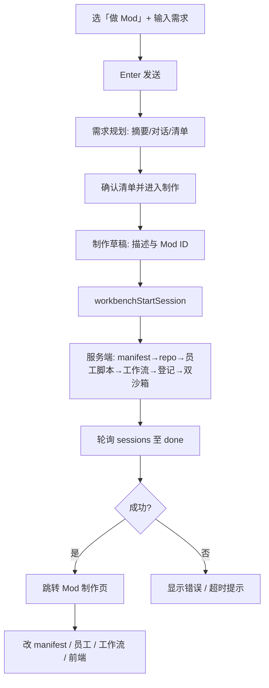

# 工作台「做 Mod」流程说明

本文描述 **MODstore market 工作台** 中通过 **二档「做」** 创建或迭代 Mod 的端到端流程，依据源码 `market/src/views/WorkbenchHomeView.vue` 与 `market/src/views/ModAuthoringView.vue` 整理。

---

## 1. 前置条件：什么是「二档」

- 工作台 UI 分为 **档位（gear）**：**一档**为直接聊天，**二档**为「聊 / 做 / 说」中的 **「做」**（`activeGear === 'make'`），**三档**为语音规划等。
- **二档主输入区**仅在用户已具备 **工作流上下文**（`hasWorkflow === true`，即已从顶栏工作台进入带仓库/工作流的会话）时出现；否则首页只显示引导，提示从顶栏进入 Mod 库、员工或工作流。

---

## 2. 选择制作类型：「做 Mod」

- 在 **无进行中任务** 时，底部会显示 **快捷入口**（`wb-starters`）。
- 点击 **「做 Mod」** 会将 `composerIntent` 设为 `'mod'`，并聚焦主输入框。
- 产品文案概括：**先建仓库 · 行业 JSON · 员工命名（不必一次完善）**；侧栏说明强调：可先生成骨架，再补齐 **员工包登记、工作流绑定、真实执行验证**（仅有名片不等于可执行员工）。

---

## 3. 两条常见路径

### 路径 A：从自然语言「新建 / 大改」Mod（主路径）

适用于在输入框里描述需求，经 **需求规划 → 执行清单 → 制作草稿 → 后端编排** 生成或更新 Mod。

1. **描述想法**  
   - 在 **「描述想法」** 主输入框输入需求（可附 **PDF / Word / Excel / 文本** 等附件）。  
   - **Enter**：发送（若处于规划对话的 `chat` 阶段，Enter 会发规划回复；见下）。  
   - **Shift+Enter**：换行。  
   - 页脚说明：**Enter 发送后先进入「需求规划」**，多轮澄清并生成执行清单，确认后再打开「制作草稿」启动生成。

2. **（可选）制作前端**  
   - 当 `composerIntent === 'mod'` 时，输入区旁显示 **「制作前端」** 开关（`modFrontendEnabled`）。  
   - **开启**：本次编排请求会带 `generate_frontend: true`，为 Mod 生成可路由的 **Vue 前端** 并在 manifest 中暴露入口（与首次生成时的后端契约一致）。  
   - **关闭**：只生成 **Mod 骨架、员工与工作流能力**，不生成定制前端页面。

3. **模型**  
   - **Auto**：按账户偏好选模型；若默认厂商无密钥，会改用已配置密钥的厂商/模型。  
   - **自选**：手动选厂商与模型，并在发起编排前写回偏好（若适用）。

4. **需求规划（`planSession`）**  
   首次 **Enter 发送** 主输入后，会打开 **规划面板**（若已有 `planSession` 且非 `chat` 阶段，主输入会提示先完成或关闭规划面板）：  
   - **摘要阶段**：确认任务摘要 → **确认并开始规划**。  
   - **对话阶段**：与规划助手多轮澄清；Mod 场景下系统提示会围绕 **FHD / XCAGI 宿主已定**、**交付档位（骨架 vs 可执行闭环）** 等，而非通用技术栈问卷；可用 **快捷选项** 与 **「用以上选择发送」**。  
   - 至少完成一轮对话后，可点 **「生成执行清单」**。  
   - **清单阶段**：查看 **执行清单**，确认后点 **「确认清单并进入制作」**。

5. **制作草稿（`pendingHandoff`）**  
   - 将 **初始想法、澄清对话、执行清单** 合并为 **「Mod 需求描述」** 文本。  
   - **Mod ID（已预填，可改）**：用于 `suggested_mod_id` 等后端提示。  
   - 按钮文案：**「开始生成 Mod」** → 调用 `runOrchestration()`。

6. **编排与进度**  

   **前端**：调用 `POST /api/workbench/sessions`（`api.workbenchStartSession`），请求体含 `intent: 'mod'`、`brief`、`suggested_mod_id`、`planning_messages`、`execution_checklist`、`source_documents`、`generate_frontend` 等；默认 **`generate_full_suite: true`**（全套）。随后 **轮询** `GET /api/workbench/sessions/{session_id}` 直至 `status` 为 `done` / `error`，或超时（约 10 分钟）。界面 **「制作进度」** 中的步骤条与后端 `steps` 数组一一对应（见 `modstore_server/workbench_api.py` 中 `_default_steps("mod")`）。

   **服务端（`generate_full_suite === true` 时，顺序与产物概览）**  

   | 步骤 id | 用户可见标签（约） | 含义与产出 |
   |--------|-------------------|-----------|
   | `manifest` | 生成蓝图与 JSON | LLM 生成结构化 Mod 蓝图；得到 `manifest`、`workflow_employees` 草案、蓝图 JSON 等 |
   | `repo` | 新建 Mod 仓库 | `import_mod_suite_repository` 落盘 Mod 目录（含 `backend/`、`manifest` 等） |
   | `industry` | 生成行业卡片 | 写入行业卡片与 UI shell（侧栏菜单等） |
   | `employees` | 创建员工骨架 | 将多名员工写入 `workflow_employees`（名片级） |
   | `employee_impls` | 生成员工脚本 | `generate_mod_employee_impls_async` → 每名员工一份 `backend/employees/<stem>.py`，含 `async def run(payload, ctx)`（可经 FHD `mods_bus` 加载） |
   | `workflows` | 生成员工 Skill 组（画布编排） | `create_mod_suite_workflows_async` → 为各员工创建 **MODstore 画布 Workflow**（`apply_nl_workflow_graph` 节点与边）。与 ESkill 双层文档一致：**Workflow Node = Skill**，整条画布工作流产品侧可称 **Skill 组**（`eskill-prototype/docs/DUAL_LAYER_ARCHITECTURE.md`）。**AI 市场「Skill」类目**指可上架素材包，与引擎里「节点=Skill」不是同一层概念 |
   | `register_packs` | 登记员工包并修复图 | 对齐画布 `employee` 节点与可执行包 id，**登记 `employee_pack` 到 Catalog** |
   | `api` | 生成/绑定 API 节点 | 汇总工作流中的 OpenAPI 类节点及待配置告警 |
   | `workflow_sandbox` | 工作流沙箱测试 | **Mock 结构沙盒**：验证图可走通；**不等于**生产里真实员工已成功执行业务 |
   | `mod_sandbox` | Mod 沙箱测试 | manifest / 蓝图 / 路由骨架等校验 + **`employee_readiness`**；通过后界面文案仍提醒：**真实执行还需非 Mock 验证**（与后端 `mod_sandbox` 完成说明一致） |
   | `complete` | 完成 | 会话 `artifact` 写入 `mod_id`、`workflow_results`、`validation_summary` 等，供前端跳转 |

   **「可执行员工」边界（产品口径）**  

   - **流水线已做的**：每员工 Python 实现、工作流图、（尝试）**Catalog 登记**、画布节点对齐、**Mock 沙箱**、可用性分析报告写入蓝图。  
   - **仍可能需人工或在 Mod 制作页兜底的**：审核失败、密钥/Embedding、绑错 `workflow_id`、或需在宿主 **FHD** 上跑 **非 Mock** 路径时，应在 **Mod 制作页「员工可用性闭环」**（见下文 §5）用 **一键登记 / 写入关联 / 进画布** 等按钮补齐；**仅 Mock 通过不承诺生产一次成功**。  

   **最小 Mod 模式（脚注）**：若请求体将 **`generate_full_suite` 设为 `false`**，后端走「最小 manifest」分支：会 **跳过** 行业套件扩展、每员工脚本、工作流、登记与双沙箱等大部分步骤，仅适合快速占位；与上表「全套」不是同一条路径。

7. **成功后的跳转**  
   - 若返回 `intent === 'mod'` 且 `artifact.mod_id` 存在：  
     - **路由跳转** `name: 'mod-authoring'`，`params: { modId }` → **Mod 制作页**（`ModAuthoringView.vue`），继续编辑 manifest、`workflow_employees`、文件等。

### 路径 B：编辑仓库里已有 Mod（不经本轮 AI 编排）

适用于已有 Mod，只想打开制作页修改。

1. 确认当前为 **做 Mod** 意图，且 **未处于需求规划会话**（`planSession` 为空时才会显示仓库区）。  
2. 在 **「仓库已有（可跳转编辑）」** 下拉里 **选择 Mod**（数据来自 `api.listMods()`）。  
3. 点击 **「去 Mod 制作」** → `router.push({ name: 'mod-authoring', params: { modId }, query: { mode: 'edit' } })`。

---

## 4. 与工作流产物的衔接（可选）

若当前意图是 **做工作流** 且编排生成了画布工作流，可能出现 **「工作流已就绪」** 卡片：可将工作流 **关联到某 Mod**（写入 `manifest.workflow_employees` 等），再 **「关联并打开 Mod」** 进入同一 `mod-authoring` 路由。

---

## 5. Mod 制作页上可继续做的事（`ModAuthoringView.vue`）

- **多页签**：概览、配置 JSON、文件、工作流关联、**前端**（若已生成）等。  
- **员工可用性闭环**：检查 `employee_pack` 登记、`workflow_id`、画布 `employee` 节点与可执行包 id 是否一致；支持行内 **一键登记** 等兜底。  
- **重新生成前端**：调用 `POST /api/mods/{mod_id}/frontend/regenerate`，仅覆盖前端相关产物（与首次「制作前端」开关对应的契约一致）。

---

## 6. FHD 宿主：扩展总线 `app.mod_sdk` 与 Mod 落地

编排生成的 Mod 目录需出现在 FHD 的 **`XCAGI_MODS_ROOT`**（或默认的 `mods/`）下，由宿主 [`ModManager.load_mod_routes`](e:\FHD\app\infrastructure\mods\mod_manager.py) 挂载 `register_fastapi_routes`。

### 6.1 唯一稳定对接面

FHD 约定：**Mod 业务代码只允许** `from app.mod_sdk.<子模块> import ...`（见 [`FHD/app/mod_sdk/__init__.py`](e:\FHD\app\mod_sdk\__init__.py)）。常见子模块：

| 子模块 | 用途 |
|--------|------|
| `mod_sdk.mods_bus` | `import_mod_backend_py`，加载本 Mod `backend/employees/<stem>.py` 等 |
| `mod_sdk.comms` | Mod 间同步调用总线：`get_mod_comms().register` / `call`（示例：`example-mod` 注册 `ping`；`sz-qsm-pro` 注册 `mod_info`） |
| `mod_sdk.services` | 宿主高层服务：`get_ai_chat_app_service`、`get_products_service` 等 |
| `mod_sdk.mod_employee_llm` | **窄 LLM 入口** `mod_employee_complete`：由生成物 `backend/blueprints.py` 内 `_call_llm` **优先**调用，走宿主已配置的 `DEEPSEEK_API_KEY`（经 `AIConversationService.call_deepseek_api`） |

### 6.2 员工脚本里的 LLM

- 生成模板 `backend/blueprints.py` 中 **`_call_llm`**：先 `await mod_employee_complete(...)`（`app.mod_sdk.mod_employee_llm`）；若不可用或未配置密钥，再回退 **同进程** 的 `modstore_server.llm_chat_proxy`（便于 MODstore 一体化调试）。
- 员工 `run(payload, ctx)` 应优先 **`await ctx["call_llm"](...)`**，而不是在员工文件内直连外部密钥。

### 6.3 （可选）部署后冒烟

若需验证 `POST /api/mod/{id}/employees/{emp_id}/run`，可在 CI 或运维脚本中对已部署 FHD 基址发起探测；当前仓库未强制实现该步骤，可按环境自行加一层健康检查。

---

## 7. 关键源码位置（便于维护）

| 内容 | 文件与说明 |
|------|------------|
| 二档 UI、规划、清单、制作草稿、编排、Mod 列表与跳转 | `market/src/views/WorkbenchHomeView.vue` |
| Mod 元数据、员工表、前端页签与 regenerate | `market/src/views/ModAuthoringView.vue` |
| 前端 regenerate API | `market/src/api.ts` → `frontend/regenerate` |
| Mod `blueprints._call_llm` 模板、行业/路由生成 | `modstore_server/mod_ai_scaffold.py`（`_BLUEPRINTS_HELPER_PREAMBLE`） |
| 每员工 Python 生成提示 | `modstore_server/mod_employee_impl_scaffold.py` |
| 宿主员工 LLM 窄接口 | `FHD/app/mod_sdk/mod_employee_llm.py` |
| Mod 全套编排步骤与实现 | `modstore_server/workbench_api.py`（`_default_steps`、`intent == "mod"` 分支） |

---

## 8. 流程简图（主路径 A）

子步骤明细见 **§3 路径 A 第 6 点**；`generate_full_suite=false` 时不走 `Fs` 内全套逻辑。

---

---

## 9. 「做员工」编排（与「做 Mod」分轨）

- **入口**：`intent: 'employee'`，步骤见 `workbench_api._default_steps`（含可选 **生成画布工作流**、**工作流沙箱**、**宿主连通性**）。
- **产物**：`employee_pack` zip（`manifest` + `backend/blueprints.py` + `backend/employees/<stem>.py` + `employee_config_v2` + 可选 `xcagi_host_profile`），与 FHD `_employees/` 安装及 `load_employee_pack_routes` 对齐。
- **模式**：`employee_target: pack_only | pack_plus_workflow`；`fhd_base_url` 可选。
- **联调清单**：`docs/workbench-employee-fullstack-e2e.md`。

---

*文档版本：与仓库 `WorkbenchHomeView.vue` / `ModAuthoringView.vue` / `app.mod_sdk` 对接策略对齐；若后端编排契约变更，请同步更新「编排与进度」与 API 小节。*
