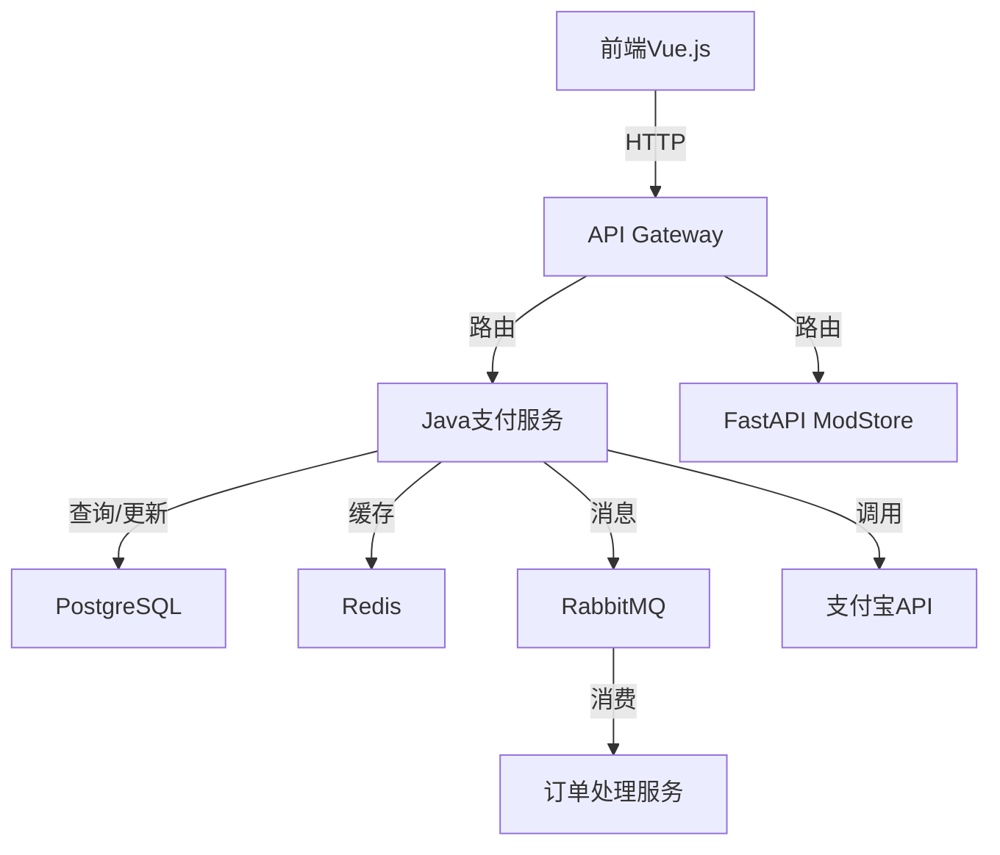
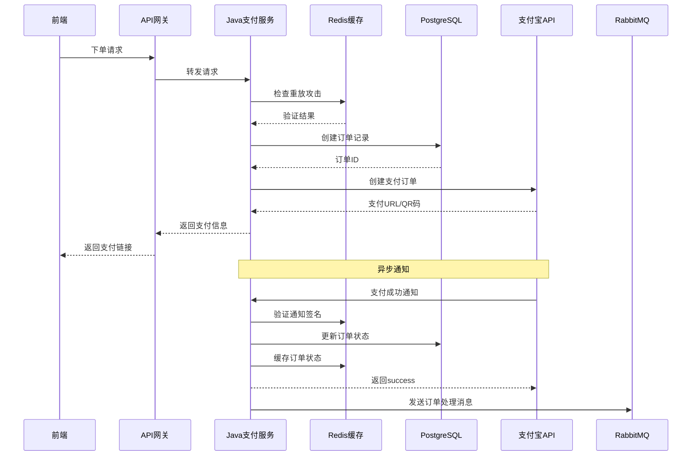

# Java支付服务设计文档

## 1. 项目概述

### 1.1 项目背景
当前MODstore系统使用Python FastAPI实现支付功能，存在以下问题：
- SQLite数据库在高并发下性能瓶颈
- JSON文件存储订单缺乏原子性
- 内存重放攻击防护集合无限增长
- 支付客户端重复创建影响性能

### 1.2 项目目标
使用Java Spring Boot技术栈重构支付服务，提升并发处理能力和系统可靠性。

## 2. 技术架构

### 2.1 技术选型

| 类别 | 技术 | 版本 | 选型理由 |
|------|------|------|----------|
| 语言 | Java | 17+ | 强类型语言，成熟的生态系统，优秀的并发支持 |
| 框架 | Spring Boot | 3.2.x | 快速开发，内嵌容器，丰富的生态 |
| 数据库 | PostgreSQL | 15.0+ | 支持事务、JSON类型，高性能，适合支付场景 |
| 缓存 | Redis | 7.0+ | 用于防重放攻击、订单状态缓存 |
| 认证 | JWT | - | 无状态认证，与现有系统兼容 |
| 消息队列 | RabbitMQ | 3.12+ | 异步处理支付通知，解耦系统 |
| 支付SDK | alipay-sdk-java | 最新版 | 官方SDK，功能完善 |

### 2.2 架构设计



### 2.3 核心流程图



## 3. 数据库设计

### 3.1 数据模型

#### 3.1.1 `users`表
| 字段名 | 数据类型 | 约束 | 描述 |
|--------|----------|------|------|
| `id` | `SERIAL` | `PRIMARY KEY` | 用户ID |
| `username` | `VARCHAR(64)` | `UNIQUE NOT NULL` | 用户名 |
| `email` | `VARCHAR(128)` | `UNIQUE` | 邮箱 |
| `password_hash` | `VARCHAR(256)` | `NOT NULL` | 密码哈希 |
| `is_admin` | `BOOLEAN` | `DEFAULT FALSE` | 是否管理员 |
| `created_at` | `TIMESTAMP` | `DEFAULT CURRENT_TIMESTAMP` | 创建时间 |

#### 3.1.2 `wallets`表
| 字段名 | 数据类型 | 约束 | 描述 |
|--------|----------|------|------|
| `id` | `SERIAL` | `PRIMARY KEY` | 钱包ID |
| `user_id` | `INTEGER` | `REFERENCES users(id) UNIQUE NOT NULL` | 用户ID |
| `balance` | `DECIMAL(10,2)` | `DEFAULT 0.00` | 余额 |
| `updated_at` | `TIMESTAMP` | `DEFAULT CURRENT_TIMESTAMP` | 更新时间 |

#### 3.1.3 `transactions`表
| 字段名 | 数据类型 | 约束 | 描述 |
|--------|----------|------|------|
| `id` | `SERIAL` | `PRIMARY KEY` | 交易ID |
| `user_id` | `INTEGER` | `REFERENCES users(id) NOT NULL` | 用户ID |
| `amount` | `DECIMAL(10,2)` | `NOT NULL` | 金额 |
| `txn_type` | `VARCHAR(32)` | `NOT NULL` | 交易类型 |
| `status` | `VARCHAR(16)` | `DEFAULT 'completed'` | 状态 |
| `description` | `TEXT` | `DEFAULT ''` | 描述 |
| `created_at` | `TIMESTAMP` | `DEFAULT CURRENT_TIMESTAMP` | 创建时间 |

#### 3.1.4 `orders`表
| 字段名 | 数据类型 | 约束 | 描述 |
|--------|----------|------|------|
| `id` | `SERIAL` | `PRIMARY KEY` | 订单ID |
| `out_trade_no` | `VARCHAR(64)` | `UNIQUE NOT NULL` | 商户订单号 |
| `trade_no` | `VARCHAR(64)` | | 支付宝交易号 |
| `user_id` | `INTEGER` | `REFERENCES users(id) NOT NULL` | 用户ID |
| `subject` | `VARCHAR(256)` | `NOT NULL` | 订单标题 |
| `total_amount` | `DECIMAL(10,2)` | `NOT NULL` | 总金额 |
| `order_kind` | `VARCHAR(32)` | `NOT NULL` | 订单类型 |
| `item_id` | `INTEGER` | | 商品ID |
| `plan_id` | `VARCHAR(64)` | | 套餐ID |
| `status` | `VARCHAR(16)` | `DEFAULT 'pending'` | 状态 |
| `buyer_id` | `VARCHAR(64)` | | 买家ID |
| `paid_at` | `TIMESTAMP` | | 支付时间 |
| `fulfilled` | `BOOLEAN` | `DEFAULT FALSE` | 是否已发放权益 |
| `created_at` | `TIMESTAMP` | `DEFAULT CURRENT_TIMESTAMP` | 创建时间 |
| `updated_at` | `TIMESTAMP` | `DEFAULT CURRENT_TIMESTAMP` | 更新时间 |

#### 3.1.5 `purchase`表
| 字段名 | 数据类型 | 约束 | 描述 |
|--------|----------|------|------|
| `id` | `SERIAL` | `PRIMARY KEY` | 购买ID |
| `user_id` | `INTEGER` | `REFERENCES users(id) NOT NULL` | 用户ID |
| `catalog_id` | `INTEGER` | `NOT NULL` | 商品ID |
| `amount` | `DECIMAL(10,2)` | `NOT NULL` | 支付金额 |
| `created_at` | `TIMESTAMP` | `DEFAULT CURRENT_TIMESTAMP` | 创建时间 |

### 3.2 索引设计

| 表名 | 索引名 | 索引字段 | 类型 | 用途 |
|------|--------|----------|------|------|
| `users` | `idx_users_username` | `username` | `UNIQUE` | 用户名查询 |
| `users` | `idx_users_email` | `email` | `UNIQUE` | 邮箱查询 |
| `orders` | `idx_orders_out_trade_no` | `out_trade_no` | `UNIQUE` | 订单号查询 |
| `orders` | `idx_orders_user_id` | `user_id` | `BTREE` | 用户订单查询 |
| `orders` | `idx_orders_status` | `status` | `BTREE` | 状态筛选 |
| `transactions` | `idx_transactions_user_id` | `user_id` | `BTREE` | 用户交易查询 |

## 4. API设计

### 4.1 认证API

| API路径 | 方法 | 模块 | 功能描述 | 请求体 (JSON) | 成功响应 (200 OK) |
|---------|------|------|----------|--------------|-------------------|
| `/api/auth/me` | `GET` | `AuthController` | 获取当前用户信息 | N/A | `{"user": {"id": 1, "username": "admin", "email": "admin@example.com", "is_admin": true}}` |

### 4.2 支付API

| API路径 | 方法 | 模块 | 功能描述 | 请求体 (JSON) | 成功响应 (200 OK) |
|---------|------|------|----------|--------------|-------------------|
| `/api/payment/plans` | `GET` | `PaymentController` | 获取可用套餐列表 | N/A | `{"plans": [{"id": "plan_basic", "name": "基础版 MOD", "price": 9.90, ...}]}` |
| `/api/payment/checkout` | `POST` | `PaymentController` | 创建支付订单 | `{"plan_id": "plan_basic", "total_amount": 9.90, "subject": "基础版 MOD", "request_id": "...", "timestamp": 1234567890, "signature": "..."}` | `{"ok": true, "order_id": "MOD1234567890", "type": "page", "redirect_url": "..."}` |
| `/api/payment/notify/alipay` | `POST` | `AlipayController` | 支付宝异步通知 | Form Data | `"success"` |
| `/api/payment/query/{out_trade_no}` | `GET` | `PaymentController` | 查询订单状态 | N/A | `{"out_trade_no": "MOD1234567890", "status": "paid", ...}` |
| `/api/payment/orders` | `GET` | `PaymentController` | 列出用户订单 | N/A | `{"orders": [...], "total": 10}` |
| `/api/payment/entitlements` | `GET` | `PaymentController` | 获取用户权益 | N/A | `{"items": [...], "total": 5}` |

### 4.3 钱包API

| API路径 | 方法 | 模块 | 功能描述 | 请求体 (JSON) | 成功响应 (200 OK) |
|---------|------|------|----------|--------------|-------------------|
| `/api/wallet` | `GET` | `WalletController` | 获取钱包余额 | N/A | `{"balance": 100.00, "updated_at": "2026-04-24T10:00:00Z"}` |
| `/api/wallet/transactions` | `GET` | `WalletController` | 获取交易记录 | N/A | `{"transactions": [...], "total": 20}` |

## 5. 核心功能模块

### 5.1 支付核心模块

#### 5.1.1 订单管理
- **功能**：创建、查询、更新订单状态
- **实现**：`OrderService` + `OrderRepository`
- **特点**：支持事务处理，状态管理

#### 5.1.2 支付宝集成
- **功能**：支付宝SDK封装，支付下单，通知处理
- **实现**：`AlipayService`
- **特点**：支持PC、手机、扫码支付

#### 5.1.3 防重放攻击
- **功能**：验证请求签名，防止重放攻击
- **实现**：`SecurityService` + Redis
- **特点**：时间窗口验证，Redis存储已处理请求

#### 5.1.4 权益发放
- **功能**：支付成功后发放权益
- **实现**：`EntitlementService`
- **特点**：事务保证，幂等处理

### 5.2 钱包模块

#### 5.2.1 余额管理
- **功能**：查询、更新用户余额
- **实现**：`WalletService` + `WalletRepository`
- **特点**：并发安全，事务保证

#### 5.2.2 交易记录
- **功能**：记录所有交易操作
- **实现**：`TransactionService` + `TransactionRepository`
- **特点**：完整的交易历史

### 5.3 异步处理模块

#### 5.3.1 消息队列
- **功能**：异步处理订单状态更新
- **实现**：`RabbitMQConfig` + `OrderConsumer`
- **特点**：解耦系统，提高可靠性

#### 5.3.2 定时任务
- **功能**：订单超时处理，状态同步
- **实现**：`ScheduledTasks`
- **特点**：自动处理异常订单

## 6. 配置管理

### 6.1 环境变量

| 配置项 | 类型 | 默认值 | 说明 |
|--------|------|--------|------|
| `SERVER_PORT` | `int` | `8080` | 服务端口 |
| `DATABASE_URL` | `string` | - | 数据库连接URL |
| `REDIS_URL` | `string` | `redis://localhost:6379` | Redis连接URL |
| `RABBITMQ_URL` | `string` | `amqp://localhost:5672` | RabbitMQ连接URL |
| `JWT_SECRET` | `string` | - | JWT密钥 |
| `ALIPAY_APP_ID` | `string` | - | 支付宝应用ID |
| `ALIPAY_PRIVATE_KEY` | `string` | - | 应用私钥 |
| `ALIPAY_PUBLIC_KEY` | `string` | - | 支付宝公钥 |
| `ALIPAY_NOTIFY_URL` | `string` | - | 异步通知URL |
| `ALIPAY_DEBUG` | `boolean` | `false` | 调试模式 |

### 6.2 配置文件

```yaml
# application.yml
spring:
  datasource:
    url: ${DATABASE_URL}
    username: ${DATABASE_USER}
    password: ${DATABASE_PASSWORD}
  redis:
    url: ${REDIS_URL}
  rabbitmq:
    addresses: ${RABBITMQ_URL}

alipay:
  app-id: ${ALIPAY_APP_ID}
  private-key: ${ALIPAY_PRIVATE_KEY}
  public-key: ${ALIPAY_PUBLIC_KEY}
  notify-url: ${ALIPAY_NOTIFY_URL}
  debug: ${ALIPAY_DEBUG}

jwt:
  secret: ${JWT_SECRET}
  expiration: 86400
```

## 7. 部署方案

### 7.1 容器化部署

**Dockerfile**：
```dockerfile
FROM openjdk:17-jdk-slim
WORKDIR /app
COPY target/payment-service.jar .
EXPOSE 8080
ENV JAVA_OPTS="-Xms512m -Xmx1024m"
CMD java $JAVA_OPTS -jar payment-service.jar
```

**docker-compose.yml**：
```yaml
version: '3.8'
services:
  payment-service:
    build: .
    ports:
      - "8080:8080"
    environment:
      - DATABASE_URL=jdbc:postgresql://postgres:5432/payment_db
      - REDIS_URL=redis://redis:6379
      - RABBITMQ_URL=amqp://rabbitmq:5672
    depends_on:
      - postgres
      - redis
      - rabbitmq

  postgres:
    image: postgres:15
    environment:
      - POSTGRES_DB=payment_db
      - POSTGRES_USER=admin
      - POSTGRES_PASSWORD=password
    volumes:
      - postgres_data:/var/lib/postgresql/data

  redis:
    image: redis:7
    volumes:
      - redis_data:/data

  rabbitmq:
    image: rabbitmq:3.12-management
    ports:
      - "15672:15672"

volumes:
  postgres_data:
  redis_data:
```

### 7.2 集群部署

- **负载均衡**：使用Nginx或Kong进行负载均衡
- **水平扩展**：根据流量动态调整实例数量
- **数据一致性**：使用PostgreSQL主从复制保证数据可靠性

## 8. 监控与日志

### 8.1 监控

- **Prometheus**：收集指标数据
- **Grafana**：可视化监控面板
- **Spring Boot Actuator**：暴露健康检查端点

### 8.2 日志

- **ELK Stack**：ELasticsearch + Logstash + Kibana
- **结构化日志**：JSON格式日志，便于分析
- **业务日志**：关键操作日志记录

## 9. 性能优化

### 9.1 数据库优化

- **连接池**：使用HikariCP，配置合理的连接池大小
- **索引**：为查询频繁的字段创建索引
- **批量操作**：使用批量插入减少数据库交互
- **缓存**：热点数据缓存

### 9.2 应用优化

- **线程池**：合理配置线程池大小
- **异步处理**：非关键操作异步执行
- **缓存**：使用Redis缓存订单状态
- **连接复用**：复用HTTP连接和数据库连接

### 9.3 网络优化

- **HTTP/2**：支持HTTP/2协议
- **压缩**：启用响应压缩
- **CDN**：静态资源使用CDN

## 10. 安全考虑

### 10.1 认证与授权

- **JWT认证**：无状态认证
- **权限控制**：基于角色的权限控制
- **密码加密**：使用bcrypt加密密码

### 10.2 数据安全

- **HTTPS**：全程HTTPS传输
- **敏感数据加密**：数据库敏感字段加密
- **防SQL注入**：使用参数化查询

### 10.3 防攻击措施

- **防重放攻击**：时间戳+签名验证
- **防DDoS**：限流措施
- **输入验证**：严格的参数验证
- **CSRF防护**：使用CSRF令牌

## 11. 迁移计划

### 11.1 数据迁移

1. **导出SQLite数据**：使用脚本导出现有数据
2. **转换数据格式**：将SQLite数据转换为PostgreSQL格式
3. **导入PostgreSQL**：将转换后的数据导入新数据库
4. **验证数据**：确保数据完整性

### 11.2 服务迁移

1. **部署Java服务**：部署新的Java支付服务
2. **配置路由**：配置API网关路由规则
3. **灰度发布**：逐步切换流量
4. **监控**：密切监控系统运行状态

### 11.3 回滚方案

- **保留原有服务**：暂时保留原有Python服务
- **快速切换**：配置API网关快速切换回原有服务
- **数据同步**：确保数据可以双向同步

## 12. 测试计划

### 12.1 单元测试

- **覆盖范围**：核心业务逻辑
- **测试框架**：JUnit 5 + Mockito
- **代码覆盖率**：目标80%以上

### 12.2 集成测试

- **测试场景**：API集成，数据库操作
- **测试工具**：Testcontainers
- **测试环境**：隔离的测试环境

### 12.3 性能测试

- **测试工具**：JMeter或Gatling
- **测试场景**：并发下单，支付通知处理
- **性能目标**：支持1000 QPS

### 12.4 安全测试

- **测试内容**：SQL注入，XSS，CSRF
- **测试工具**：OWASP ZAP
- **安全目标**：通过基本安全扫描

## 13. 结论

本设计文档详细规划了Java支付服务的架构、功能和部署方案。通过使用Java Spring Boot、PostgreSQL、Redis等技术栈，解决了当前系统的并发瓶颈问题，提升了系统的可靠性和性能。

该设计方案具有以下优势：
- **高性能**：异步处理，连接池优化
- **高可靠**：事务保证，消息队列解耦
- **易扩展**：模块化设计，水平扩展能力
- **安全**：完善的安全措施

通过本方案的实施，可以显著提升MODstore系统的支付处理能力，为用户提供更流畅的支付体验。