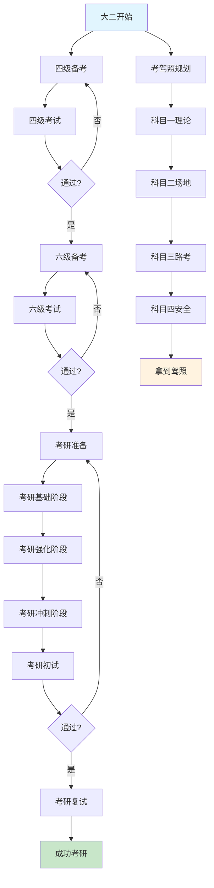
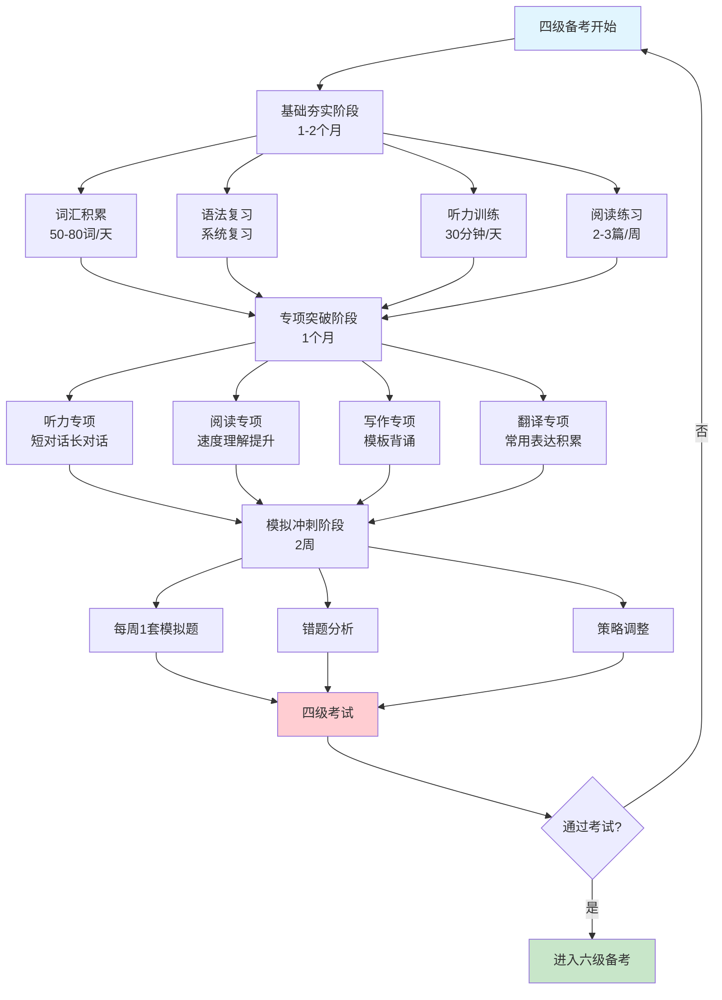
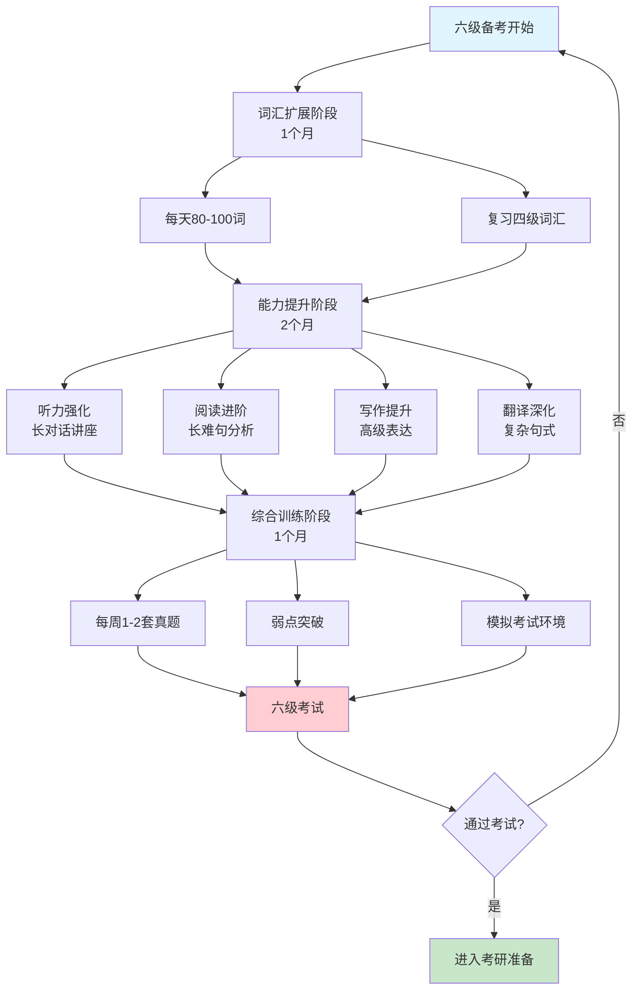
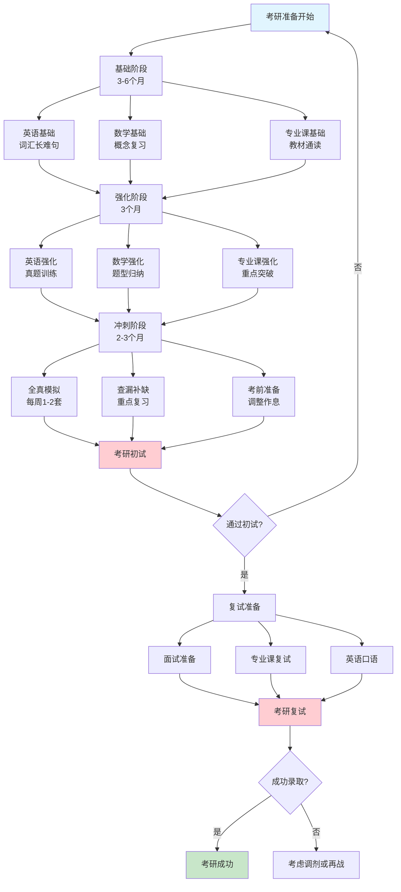
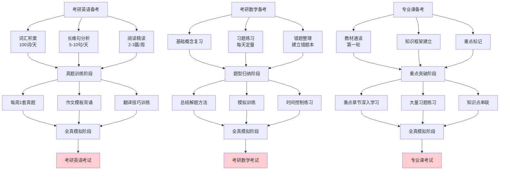
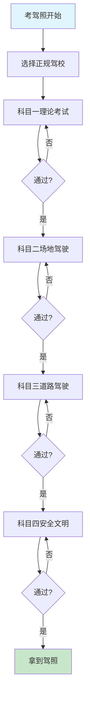
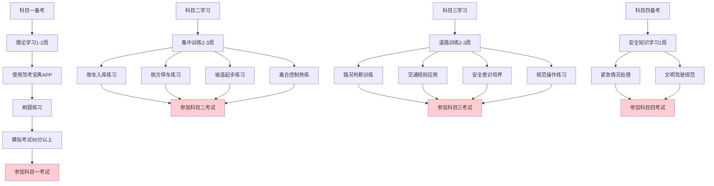
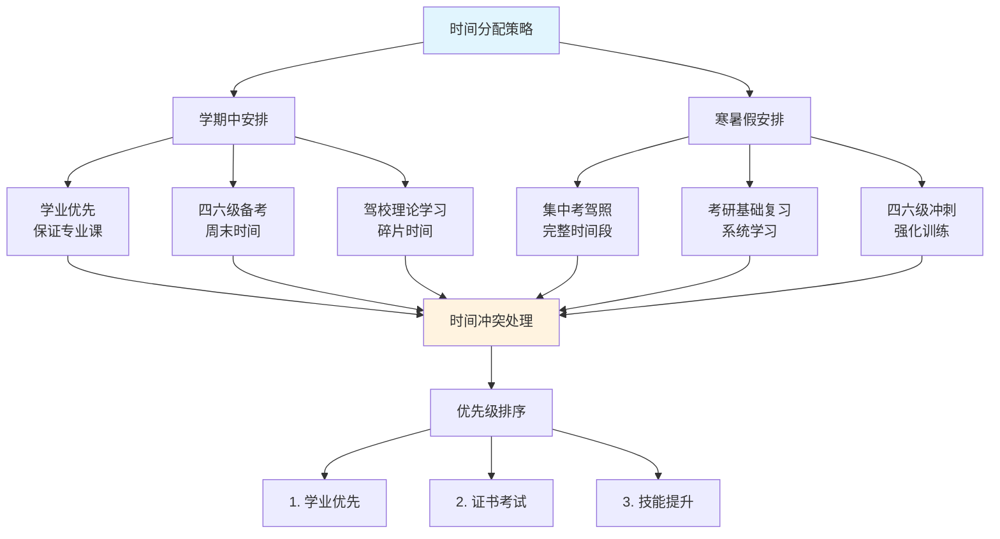

# 大二开始考四六级到考研的完整流程图

## 一、整体流程图

### 1.1 大学四年整体规划流程图

## 二、四六级考试详细流程图

### 2.1 四级考试备考流程图

### 2.2 六级考试备考流程图

## 三、考研备考详细流程图

### 3.1 考研整体备考流程图

### 3.2 考研各科目备考流程图

## 四、考驾照详细流程图

### 4.1 考驾照完整流程图

### 4.2 各科目详细学习流程图

## 五、时间协调流程图

### 5.1 学期中与寒暑假时间分配流程图

## 六、流程图使用说明

### 6.1 如何阅读流程图

1. **图形含义**
   - 矩形框：具体任务或阶段
   - 菱形框：决策点（通过/不通过）
   - 箭头：流程方向
   - 颜色标识：开始（浅蓝）、考试（浅红）、成功（浅绿）
2. **时间节点**
   - 每个阶段都标注了建议的时间长度
   - 可以根据个人情况适当调整
3. **决策路径**
   - "是"路径：继续下一阶段
   - "否"路径：返回重新准备

### 6.2 流程图应用建议

1. **打印使用**：可以将流程图打印出来，标记已完成的任务
2. **电子版跟踪**：在电子设备上使用，实时更新进度
3. **个性化调整**：根据个人情况适当调整流程节点
4. **定期回顾**：每月回顾一次，确保按计划执行

## 七、总结

这些流程图提供了从大二开始到考研成功的完整可视化路径，包括：

- **整体规划流程**：大学四年的宏观安排
- **四六级备考流程**：分阶段的详细学习路径
- **考研备考流程**：各科目的系统准备方法
- **考驾照流程**：四个科目的学习考试流程
- **时间协调流程**：学期与假期的合理分配

通过流程图可以更直观地理解整个规划的逻辑关系和时间安排，帮助您更好地执行学习计划。
